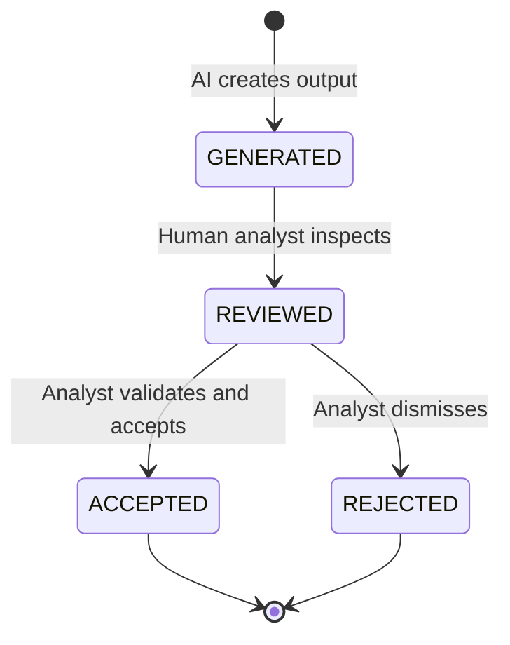
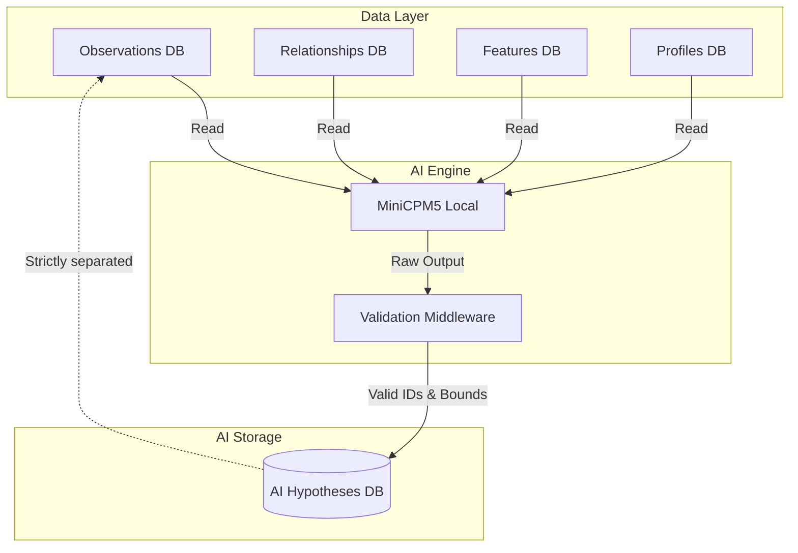

# Wolverine Intelligence: AI Integration Specification

## 1. AI Philosophy

> [!CAUTION]
> AI is NEVER the hidden source of truth in Wolverine Intelligence.

The AI component operates strictly as a **REASONING/EXPLANATION layer**. Its outputs are purely advisory and serve to assist human analysts in navigating complex data spaces. 

*   **No Authoritative Claims:** AI output is always advisory, never authoritative.
*   **Referential Integrity:** AI output must always reference existing database IDs.
*   **Boundary Enforcement:** AI never becomes the hidden source of facts, identity labels, final attribution, or cryptographic verification.
*   **Evidence Classes:** AI-generated content always falls under the `AI_HYPOTHESIS` evidence class and must be clearly distinguished from `OBSERVED`, `DETERMINISTIC_MATCH`, and `CRYPTOGRAPHIC_PROOF`.

## 2. Model Selection

*   **Primary Model:** MiniCPM5 (or equivalent local model).
*   **Deployment Strategy:** Local deployment only.
*   **Rationale:** 
    *   *Data Sovereignty:* Sensitive threat intelligence data must not leave the secure network.
    *   *No External Dependency:* Operations cannot be halted by third-party API outages or rate limits.
    *   *Reproducibility:* The exact model weights and configuration must be known and version-controlled to reproduce any given hypothesis.
*   **Model Versioning:** Every AI invocation and output MUST record the exact model version used (e.g., `minicpm5-v1.2.0`).

## 3. Allowed Uses

The AI layer is strictly limited to the following use cases:

### 3.1. Summarization
*   **Input:** Set of observations, relationships, and evidence for a specific actor or case.
*   **Output:** Natural language summary with inline ID references.
*   **Example:** "Actor A-1234 has 3 personas across Tor and I2P with stylometric similarity of 0.87 (model v2.1). Evidence: [E-5678, E-5679]"

### 3.2. Hypothesis Generation
*   **Input:** Actor profile with current relationships, features, and intelligence gaps.
*   **Output:** List of hypotheses with referenced evidence and confidence.
*   **Example:** "Hypothesis: Personas P-1234 (Tor) and P-5678 (I2P) may be the same actor based on temporal correlation (0.72) and shared PGP subkey. Requires verification of [identifier I-9012]."

### 3.3. Cross-Evidence Narrative
*   **Input:** Multiple evidence items for an attribution candidate.
*   **Output:** Coherent narrative explanation connecting the evidence.
*   **Constraint:** Must cite specific observation IDs, relationship IDs, and feature values.

### 3.4. Candidate Pattern Detection
*   **Input:** Batch of unlinked personas or identifiers.
*   **Output:** Suggested investigation targets with supporting rationale.
*   **Output Class:** `AI_HYPOTHESIS` (never `OBSERVED` or `DETERMINISTIC_MATCH`).

## 4. Disallowed Uses

> [!WARNING]
> The following operations are EXPLICITLY FORBIDDEN for the AI layer.

*   AI **CANNOT** create database facts (observations).
*   AI **CANNOT** assign identity labels (e.g., "this is definitely the same person").
*   AI **CANNOT** produce final attribution scores.
*   AI **CANNOT** verify cryptographic evidence.
*   AI **CANNOT** override observed facts or deterministic matches.
*   AI **CANNOT** modify existing relationships or observations.
*   AI output **CANNOT** bypass the evidence class system.

## 5. AIHypothesis Schema

| Field Name | Type | Required | Description | Constraints |
| :--- | :--- | :---: | :--- | :--- |
| `hypothesisId` | UUID | Yes | Unique identifier for the hypothesis. | standard UUIDv4 |
| `modelVersion` | string | Yes | The exact version of the AI model used. | e.g., `minicpm5-v1.2.0` |
| `inputObservationIds` | UUID[] | Yes | Array of observation IDs provided as input. | Must exist in DB |
| `inputRelationshipIds` | UUID[] | Yes | Array of relationship IDs provided as input. | Must exist in DB |
| `hypothesisType` | enum | Yes | Type of AI operation. | `SUMMARIZATION`, `HYPOTHESIS`, `NARRATIVE`, `PATTERN` |
| `hypothesisText` | text | Yes | The natural language output. | |
| `referencedEntityIds` | UUID[] | Yes | Entity IDs referenced in the `hypothesisText`. | Must exist in DB |
| `confidence` | float | Yes | Model's self-assessed confidence. | 0.0 to 1.0 (NOT calibrated attribution confidence) |
| `status` | enum | Yes | Current review status. | `GENERATED`, `REVIEWED`, `ACCEPTED`, `REJECTED` |
| `reviewedBy` | string | No | ID or name of the human reviewer. | Required if status is not `GENERATED` |
| `reviewedAt` | timestamp | No | Timestamp of the review. | ISO 8601 |
| `createdAt` | timestamp | Yes | Timestamp of generation. | ISO 8601 |

## 6. AI Output Lifecycle

*   **Constraint:** Only `ACCEPTED` hypotheses can be cited as supporting evidence in further analyst reports.
*   **Constraint:** Even `ACCEPTED` hypotheses remain entirely within the `AI_HYPOTHESIS` class and are never promoted to `OBSERVED`.

## 7. Integration Architecture

> [!IMPORTANT]
> The AI Engine has **Read-Only** access to the primary intelligence databases. It can only write to the isolated `ai_hypotheses` table.

## 8. Guardrails

*   **Input Token Limits:** Requests exceeding the model's context window will be rejected or paginated securely.
*   **Output Validation:** The Validation Middleware parses the AI output to extract all referenced IDs.
*   **Hallucination Detection:** Every ID extracted from the output MUST be queried against the Data Layer. If any ID does not exist, the output is flagged as hallucinated and rejected before storage.
*   **Rate Limiting:** AI invocations are rate-limited per user to prevent denial-of-service on local GPU resources.
*   **Audit Logging:** Every AI request, prompt, response, and validation result is logged for auditability.

## 9. Operability

### HOW TO run the AI model locally
1. Ensure GPU drivers and Docker with NVIDIA runtime are installed.
2. Run `docker-compose -f ai-compose.yml up -d` to start the inference server.
3. The model will load weights from `/models/minicpm5-v1.2.0/`.

### HOW TO generate a hypothesis for an actor
1. Select an Actor profile in the Wolverine UI.
2. Click "Generate AI Hypothesis".
3. The system bundles relevant `OBSERVED` facts and invokes the AI service.

### HOW TO review AI output
1. Navigate to the "AI Queue" dashboard.
2. Select a `GENERATED` hypothesis.
3. Review the text and cited evidence.
4. Click "Accept" or "Reject".

### HOW TO inspect AI model version and configuration
1. Use the CLI tool: `wolverine-ai status`
2. Expected output includes: Model Version, Active Context Window limit, and System Prompt hash.
