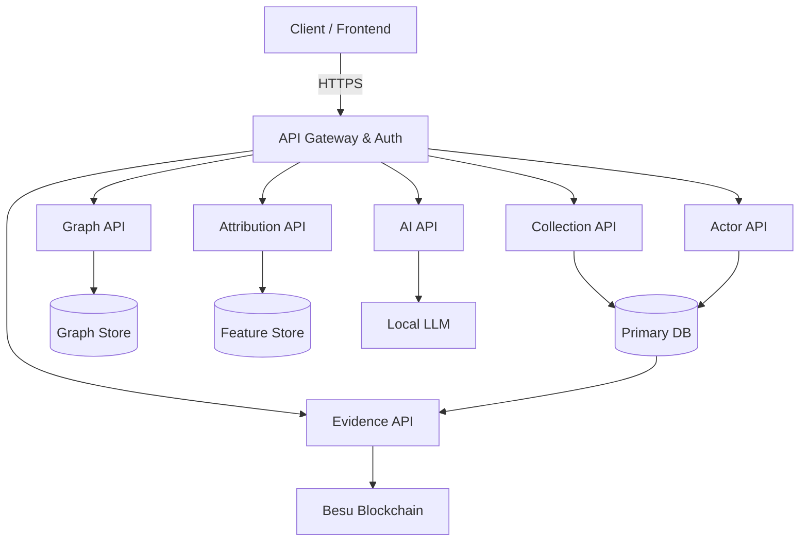

# Wolverine Intelligence API Contract Specification

> [!IMPORTANT]
> This document defines the API contract for the Wolverine Intelligence platform. AI is NEVER the hidden source of truth; every API response containing inferred or generated data MUST explicitly cite its provenance and evidence class.

## 1. API Architecture Overview

The Wolverine Intelligence platform exposes a RESTful JSON API designed for analyst consumption and programmatic integration. 

*   **Base URL:** `/api/v1/`
*   **Authentication:** JWT (JSON Web Token) passed in the `Authorization: Bearer <token>` header.
*   **Content-Type:** `application/json`

### 1.1 Architecture Diagram



### 1.2 Response Envelope

All API responses follow a strict envelope structure to ensure consistency, pagination support, and traceability.

```json
{
  "data": { ... }, 
  "pagination": {
    "cursor": "base64_encoded_string",
    "hasMore": true,
    "total": 1050
  },
  "meta": {
    "requestId": "req-5f8a9b2c",
    "timestamp": "2026-08-22T20:53:05Z",
    "modelVersion": "wolverine-attr-v2.1.0"
  }
}
```

### 1.3 Error Format

Errors are returned with appropriate HTTP status codes (4xx, 5xx) and the following payload:

```json
{
  "error": "Invalid query parameter",
  "code": "ERR_INVALID_PARAM",
  "details": {
    "field": "confidence",
    "message": "Must be between 0.0 and 1.0"
  }
}
```

### 1.4 Evidence Class Markers

Every response that includes relationships, entity linkage, or attribution must explicitly include the evidence class. 

| Class | Meaning |
|---|---|
| `OBSERVED` | Directly witnessed from network/dataset source |
| `DETERMINISTIC_MATCH` | Exact identifier reuse (e.g., same PGP key) |
| `STATISTICAL_MATCH` | Feature-based probabilistic linkage |
| `AI_HYPOTHESIS` | Generated by local AI model, requires human review |
| `CRYPTOGRAPHIC_PROOF` | Wolverine-attested, Besu-anchored |

> [!WARNING]
> If a relationship does not contain a valid evidence class marker, the frontend must reject the payload.

## 2. Query Semantics

The API supports standardized query semantics across listing endpoints:

*   **Actor Search:** Search by `name`, `identifier`, `network`, `portal`, `confidence` (e.g., `?confidence_min=0.8`).
*   **Identifier Search:** Filter by `type` (e.g., `EMAIL`, `PGP_KEY`), `value`, `network`.
*   **Site/Portal Search:** Filter by `network`, `status` (ONLINE/OFFLINE), `name`.
*   **Infrastructure Search:** Filter by `indicatorType`, `value`, `asset`.
*   **Relationship Search:** Filter by `type`, `class` (Evidence Class), `confidenceRange`, `source`, `target`.
*   **Timeline Filtering:** Filter by `dateStart`, `dateEnd`, `entityId`, `eventType`.
*   **Source Filtering:** Filter by `networkType` (Enum: TOR, I2P, ZERONET, CLEARNET), `portalId`, `datasetId`, `collectorId`.

## 3. API Modules

### 3.1 Collection API (`/api/v1/collection/`)

Manages data gathering jobs from dark web and external sources.

| Endpoint | Method | Description | Request Payload |
|---|---|---|---|
| `/jobs` | POST | Create collection job | `{"target": string, "network": string, "depth": int}` |
| `/jobs` | GET | List collection jobs | - |
| `/jobs/:id` | GET | Get job status | - |
| `/jobs/:id/stop` | POST | Stop running job | - |
| `/stats` | GET | Collection statistics | - |

### 3.2 Actor API (`/api/v1/actors/`)

Provides access to canonicalized threat actors and their footprints.

| Endpoint | Method | Description |
|---|---|---|
| `/search` | GET | Search actors by criteria |
| `/:id` | GET | Get actor profile |
| `/:id/personas` | GET | Get actor's personas across networks |
| `/:id/identifiers` | GET | Get actor's raw identifiers |
| `/:id/relationships` | GET | Get actor's relationships |
| `/:id/timeline` | GET | Get actor's chronological timeline |
| `/:id/attribution` | GET | Get attribution candidates |
| `/:id/hypotheses` | GET | Get AI hypotheses regarding this actor |

### 3.3 Graph API (`/api/v1/graph/`)

Facilitates traversal of the intelligence graph.

| Endpoint | Method | Description | Response Schema |
|---|---|---|---|
| `/neighbors/:entityId` | GET | Get 1-hop neighbors | `{ nodes: Node[], edges: Edge[] }` |
| `/paths` | GET | Find shortest paths between `source` and `target` | `{ paths: Path[] }` |
| `/subgraph` | GET | Get multi-hop subgraph around entity | `{ nodes: Node[], edges: Edge[] }` |
| `/communities` | GET | Get community clusters (Louvain method) | `{ communities: Community[] }` |

### 3.4 Timeline API (`/api/v1/timeline/`)

| Endpoint | Method | Description |
|---|---|---|
| `/events` | GET | Query timeline events with filters |
| `/activity/:entityId` | GET | Get entity activity timeline |

### 3.5 Infrastructure API (`/api/v1/infrastructure/`)

| Endpoint | Method | Description |
|---|---|---|
| `/assets` | GET | Search infrastructure assets |
| `/assets/:id` | GET | Get asset details |
| `/assets/:id/indicators` | GET | Get linked indicators (IPs, domains) |
| `/assets/:id/scans` | GET | Get scan history |
| `/assets/:id/findings` | GET | Get specific vulnerabilities/findings |

### 3.6 Attribution API (`/api/v1/attribution/`)

Deals with probabilistic and deterministic matching of identities.
Mathematical foundation for confidence is derived via logistic calibration:
$$ P(Match | X) = \frac{1}{1 + e^{-(\beta_0 + \sum \beta_i x_i)}} $$

| Endpoint | Method | Description |
|---|---|---|
| `/candidates` | GET | Search attribution candidates |
| `/candidates/:id` | GET | Get candidate pair with feature vectors |
| `/candidates/:id/evidence` | GET | Get supporting evidence for match |
| `/evaluate` | POST | Run attribution model on specific pair |

### 3.7 AI API (`/api/v1/ai/`)

All responses from this API MUST be marked with the `AI_HYPOTHESIS` evidence class.

| Endpoint | Method | Description |
|---|---|---|
| `/hypothesize` | POST | Generate hypothesis for entity connection |
| `/summarize` | POST | Generate summary for entity/case |
| `/narrative` | POST | Generate cross-evidence narrative |
| `/hypotheses` | GET | Search previously generated hypotheses |
| `/hypotheses/:id` | PATCH | Update hypothesis status (e.g., REVIEWED, REJECTED) |

### 3.8 Evidence API (`/api/v1/evidence/`)

| Endpoint | Method | Description |
|---|---|---|
| `/verify/:observationId`| GET | Verify observation integrity against Merkle tree |
| `/receipt/:receiptId` | GET | Get trust receipt for an artifact |
| `/audit` | POST | Run integrity audit on batch of IDs |

### 3.9 Export API (`/api/v1/export/`)

| Endpoint | Method | Description |
|---|---|---|
| `/csv` | POST | Export query results as CSV |
| `/json` | POST | Export query results as JSON |
| `/report` | POST | Generate PDF/HTML report |

> [!NOTE]
> Every export must inherently contain: source provenance, timestamp, query parameters used, model version, confidence scores, and evidence references.

### 3.10 Dataset & Scan API (`/api/v1/datasets/`, `/api/v1/scans/`)

| Endpoint | Method | Description |
|---|---|---|
| `/datasets/` | GET | List registered datasets |
| `/datasets/:id` | GET | Get dataset metadata |
| `/datasets/:id/stats`| GET | Get dataset statistics |
| `/datasets/:id/ingest`| POST | Trigger dataset ingestion |
| `/scans/` | POST | Create network scan job |
| `/scans/` | GET | List scans |
| `/scans/:id` | GET | Get scan results |
| `/scans/:id/findings`| GET | Get scan findings |

## 4. Human Operability & Inspection

Operators must be able to inspect API performance and definitions.
*   **OpenAPI/Swagger UI:** Available at `/api/docs` in development environments.
*   **Health Check:** GET `/api/health` returns status of the Gateway, Primary DB, Graph DB, and Besu node.
*   **Versioning:** Subsystem versioning is strictly enforced. API requests should accept an `Accept-Version` header, defaulting to `v1`.

See [DATA-MODEL.md](DATA-MODEL.md) for full relational schema mappings.
