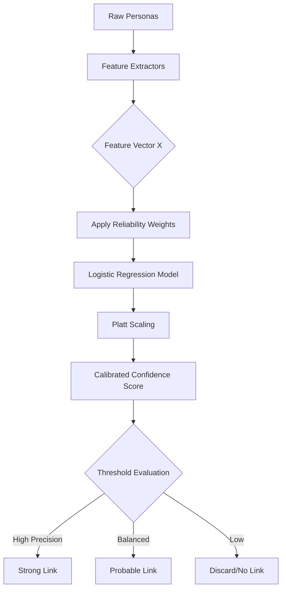

# Wolverine Intelligence: Attribution Mathematical Specification

> [!IMPORTANT]
> **SYSTEM BOUNDARY RULE**: AI is NEVER the hidden source of truth in the attribution model. All AI-generated linkages are strictly classified as `AI_HYPOTHESIS` and must either be verified by a human operator or corroborated by non-AI `OBSERVED` or `CRYPTOGRAPHIC_PROOF` evidence before altering final attribution confidence.

This document specifies the mathematical foundation of the Wolverine Intelligence attribution model. It defines the feature vectors, training mechanisms, evaluation metrics, and the baseline logistic regression model used to calculate attribution confidence scores between dark web entities.

See also: [BEHAVIOR-MODEL.md](BEHAVIOR-MODEL.md), [STYLOMETRY.md](STYLOMETRY.md), [DATA-MODEL.md](DATA-MODEL.md).

---

## 1. Feature Vector Definition

The attribution model computes the probability that two personas belong to the same underlying actor. This comparison is formalized as a fixed-length feature vector $x$:

$$x = [\text{alias}, \text{pgp}, \text{wallet}, \text{stylometry}, \text{behavior}, \text{temporal}, \text{graph}, \text{market}, \text{infrastructure}, \text{migration}]$$

Where each component $x_i \in [0,1]$. A missing or inapplicable feature strictly defaults to $0.0$.

## 2. Feature Categories

### 2.1 IDENTITY Features

| Feature | Type | Required | Description | Constraints |
|---|---|---|---|---|
| `alias` | Float | Yes | Handle/alias similarity score. | $x \in [0,1]$ |
| `pgp` | Float | Yes | PGP key relationship. | $x \in [0,1]$ |
| `wallet` | Float | Yes | Cryptocurrency wallet relationship. | $x \in [0,1]$ |

*   **`alias`**: Calculated from two handle strings.
    *   *Methods*: Computes Levenshtein distance, Jaro-Winkler, exact match, and common substring.
    *   *Normalization*: Returns $\max(\text{methods})$ normalized to $[0,1]$. Missing value: $0.0$.
*   **`pgp`**:
    *   *Input*: PGP key fingerprints, key UIDs.
    *   *Methods*: Exact fingerprint match (1.0), UID overlap (partial), key signing relationship (0.5 to 0.9 based on depth).
    *   *Missing value*: $0.0$.
*   **`wallet`**:
    *   *Input*: Wallet addresses, transaction graph.
    *   *Methods*: Same address (1.0), direct transaction (0.8), shared cluster (0.5).
    *   *Missing value*: $0.0$.

### 2.2 TEXT Features

| Feature | Type | Required | Description | Constraints |
|---|---|---|---|---|
| `stylometry` | Float | Yes | Writing style similarity. | $x \in [0,1]$ |

*   **`stylometry`**:
    *   *Input*: `StylometricProfile` from [STYLOMETRY.md](STYLOMETRY.md).
    *   *Methods*: Cosine similarity of combined normalized stylometric feature vectors.
    *   *Missing value*: $0.0$ (assigned if insufficient text to form a reliable profile).

### 2.3 BEHAVIOR Features

| Feature | Type | Required | Description | Constraints |
|---|---|---|---|---|
| `behavior` | Float | Yes | Behavioral similarity. | $x \in [0,1]$ |
| `temporal` | Float | Yes | Temporal correlation. | $x \in [0,1]$ |

*   **`behavior`**:
    *   *Input*: `BehaviorProfile` from [BEHAVIOR-MODEL.md](BEHAVIOR-MODEL.md).
    *   *Methods*: Weighted combination of feature-level similarities (e.g., opsec habits, listing types).
    *   *Missing value*: $0.0$.
*   **`temporal`**:
    *   *Input*: Activity timestamps for two entities.
    *   *Methods*: Cross-correlation of activity time series.
    *   *Missing value*: $0.0$.

### 2.4 GRAPH Features

| Feature | Type | Required | Description | Constraints |
|---|---|---|---|---|
| `graph` | Float | Yes | Graph-structural similarity. | $x \in [0,1]$ |

*   **`graph`**:
    *   *Input*: Neighborhood graphs of two entities (up to depth 2).
    *   *Methods*: Common neighbors count, Jaccard coefficient, Adamic-Adar index, degree similarity.
    *   *Aggregation*: Weighted mean of normalized methods.
    *   *Missing value*: $0.0$.

### 2.5 MARKET Features

| Feature | Type | Required | Description | Constraints |
|---|---|---|---|---|
| `market` | Float | Yes | Marketplace behavior similarity. | $x \in [0,1]$ |

*   **`market`**:
    *   *Input*: Transaction records, listings, counterparties.
    *   *Methods*: Shared counterparty count, buyer/seller consistency, category overlap.
    *   *Missing value*: $0.0$.

### 2.6 INFRASTRUCTURE Features

| Feature | Type | Required | Description | Constraints |
|---|---|---|---|---|
| `infrastructure` | Float | Yes | Infrastructure reuse indicator. | $x \in [0,1]$ |

*   **`infrastructure`**:
    *   *Input*: `InfrastructureIndicator` records (see [INFRASTRUCTURE-INTELLIGENCE.md](INFRASTRUCTURE-INTELLIGENCE.md)).
    *   *Methods*: Shared certificate, shared hosting, shared tech stack, favicon hash matches.
    *   *Missing value*: $0.0$.

### 2.7 MIGRATION Features

| Feature | Type | Required | Description | Constraints |
|---|---|---|---|---|
| `migration` | Float | Yes | Migration pattern match. | $x \in [0,1]$ |

*   **`migration`**:
    *   *Input*: Timeline events for two entities across different markets.
    *   *Methods*: Activity cessation/onset temporal correlation, community-level migration patterns.
    *   *Missing value*: $0.0$.

---

## 3. Mathematical Model

Wolverine Intelligence relies on a Logistic Regression model to maintain strict explainability and traceability of attribution scores.

> [!NOTE]
> **Why Logistic Regression?**
> We require interpretable coefficients, calibrated probabilities, and fast inference. Neural networks act as black boxes, violating our core design law that "No black-box subsystem silently determines important facts."

The log-odds $z$ of two personas belonging to the same actor is given by:

$$z = \beta_0 + \sum_{i=1}^{10} \beta_i x_i$$

The probability of a true link given the feature vector $\mathbf{x}$ is:

$$P(\text{link} | \mathbf{x}) = \frac{1}{1 + e^{-z}}$$

*   Each $\beta_i$ represents the log-odds contribution of feature $i$.
*   The sign of $\beta_i$ indicates the direction of association (expected positive for all defined features).
*   The magnitude of $\beta_i$ indicates the importance of the feature in the attribution decision.
*   **CRITICAL Constraint**: Coefficients MUST be learned from empirical data. They are NOT manually chosen by human operators.

---

## 4. Training Specification

### 4.1 Dataset Composition
*   **Positive pairs**: Known same-actor persona pairs (sourced from ground truth operations or cryptographically verified synthetic data).
*   **Negative pairs**: Known different-actor persona pairs.
*   **Hard negatives**: Personas that share some surface features (e.g., same alias but different PGP and stylometry) but are known different actors.

### 4.2 Handling Class Imbalance
The number of negative pairs in dark web analysis vastly outweighs positive pairs.
*   **Approach**: We utilize Stratified sampling and Class weights (inverse frequency) during training.
*   *Tradeoffs*: SMOTE (Synthetic Minority Over-sampling Technique) may introduce artificial variance that corrupts strict mathematical provenance; hence class weighting is preferred to maintain pure observational integrity.

### 4.3 Splits & Regularization
*   **Train/Validation/Test split**: 60/20/20, strictly stratified by actor to prevent data leakage.
*   **Cross-validation**: 5-fold CV on the training set for hyperparameter selection.
*   **Regularization**: L2 (Ridge) penalty to prevent overfitting on sparse features (e.g., rare infrastructure reuse), with a cross-validated $\lambda$.

---

## 5. Confidence Calibration

Raw model output $P(\text{link}|\mathbf{x})$ is often not a well-calibrated probability.

1.  **Calibration Method**: Apply Platt scaling (logistic regression on model outputs) or isotonic regression using the validation set.
2.  **Evaluation**: Validated via Reliability Diagrams and Brier score.
3.  **Confidence Intervals**: Defined using bootstrapping (resampling the validation set 1000 times to determine the 95% CI of the calibrated probability).

---

## 6. Threshold Selection

The system exposes configurable operating points rather than a single rigid threshold. The threshold is selected on the validation set, NEVER the test set.

*   **High Precision Threshold**: Prioritizes minimizing false positives (e.g., targeting precision > 0.95). Used for automated alert generation or legal reporting.
*   **Balanced Threshold**: Maximizes the F1 score. Used for general graph exploration.
*   **High Recall Threshold**: Prioritizes minimizing missed links (e.g., targeting recall > 0.95). Used by analysts hunting for potential new leads.

---

## 7. Source Reliability Model

Not all evidence is created equal. We define the following source reliability classes based on our **EVIDENCE TAXONOMY**:

| Category | Description | Example | Reliability Modifier |
|---|---|---|---|
| `DIRECT_SIGNED_ARTIFACT` | Cryptographically signed content | PGP-signed message (`CRYPTOGRAPHIC_PROOF`) | $1.0$ |
| `DIRECT_APPLICATION_RECORD` | Direct from application database | Forum post in HTML (`OBSERVED`) | $0.9$ |
| `CRYPTOGRAPHIC_IDENTIFIER` | Unique cryptographic identity | PGP fingerprint (`DETERMINISTIC_MATCH`) | $1.0$ |
| `THIRD_PARTY_REFERENCE` | Reference from another actor | "I bought from @vendor" (`OBSERVED`) | $0.6$ |
| `INFERRED_RELATIONSHIP` | Statistically inferred link | Stylometry match (`STATISTICAL_MATCH`) | $0.4 - 0.7$ |
| `AI_HYPOTHESIS` | AI-generated suggestion | MiniCPM5 identified pattern (`AI_HYPOTHESIS`) | $0.1$ |

> [!TIP]
> **Implementation Decision**: We use **Option A: Reliability modifies feature strength**.
> Before the feature vector $\mathbf{x}$ enters the logistic regression, each component $x_i$ is multiplied by its underlying evidence's reliability weight $w_{rel}$. This intuitively downweights features derived from hearsay or AI hypotheses, feeding a mathematically dampened signal into the model.

---

## 8. Temporal Model

Time profoundly affects attribution probability. We define explicit temporal functions to augment baseline features:

1.  **Recency decay**:
    $$w(t) = e^{-\lambda(t_{now} - t_{obs})}$$
    Where $\lambda$ controls the decay rate, discounting extremely old overlapping behavior.
2.  **Temporal overlap**:
    Fraction of time both entities are active simultaneously in a given domain.
3.  **Migration score**:
    Correlation between activity cessation on source market $M_A$ and onset on target market $M_B$.
4.  **Activity correlation**:
    Pearson correlation of activity time series (e.g., daily post volumes).

---

## 9. Model Evaluation

Models are continuously evaluated using:
*   **Metrics**: AUC-ROC, AUC-PR, F1, Precision@k, Recall@k.
*   **Calibration**: Reliability diagram, Expected Calibration Error (ECE).
*   **Feature Importance**: Absolute magnitude of the $\beta_i$ coefficients, supplemented by permutation importance checks.
*   **Error Analysis**: Standardized confusion matrix, false positive analysis (did the model falsely conflate standard opsec templates?), false negative analysis.

---

## 10. Model Versioning and Operability

Every mathematical decision must be reproducible.

### 10.1 Versioning
Every model iteration generates a version artifact recorded in the `model_versions` table.
*   Records: Training data version, feature extractor versions, hyperparameters, final $\beta$ weights, and evaluation metrics.
*   *Law*: Every attribution edge stored in the graph MUST foreign-key reference the specific `model_version` used to compute it.

### 10.2 Operability Procedures
*   **HOW TO RETRAIN**: Use `agy skills run retrain-attribution --config <path>`. This spins up the cross-validation pipeline and registers a new model candidate.
*   **HOW TO INSPECT**: Use `agy skills run explain-attribution --source <personaA> --target <personaB>`. This outputs the exact feature vector $\mathbf{x}$, the weights $\beta$, and the log-odds breakdown proving exactly *why* the score was given.
*   **HOW TO TEST**: Run `agy test --suite attribution-calibration` to verify Brier scores on the current holdout set.

