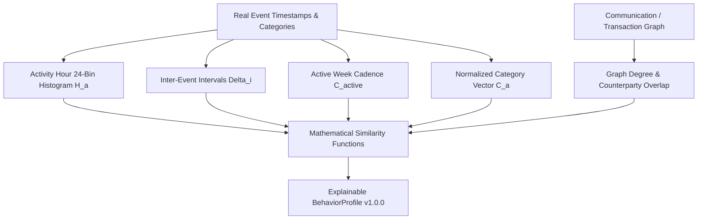

# Wolverine Intelligence: Behavioral Profiling Model (BEHAVIOR-MODEL.md)

## 1. Executive Summary & Design Laws

Behavioral telemetry models the rhythms, operational habits, posting cadences, and marketplace behaviors of threat entities.

> [!IMPORTANT]
> **Axiom 1: No Black-Box Arbitrary Weights**: Component-level similarities are computed independently (Jensen-Shannon, Cosine, Log-Ratio, Adamic-Adar). They are NOT collapsed into an arbitrary subjective weight vector. Weight fusion is calibrated downstream in the Attribution layer.
> **Axiom 2: Real Data Grounding**: BehaviorProfile v1.0.0 is computed from verified source records in the Evolution dataset (`market/vendors.tsv`, `market/listings.tsv`, `market/scrapes.tsv`, `forum/post.tsv`, `network/edges-*.tsv`).
> **Axiom 3: Sparse Actor Protection**: Entities with $< 5$ events or $< 2$ active days receive `status: "INSUFFICIENT_DATA"`.

---

## 2. Feature Taxonomy & Mathematical Formulations



### Feature 1: Activity-Hour Distribution ($H_a$)
- **Definition**: Normalized probability of activity across the 24 hours of a day in UTC.
- **Formula**:
  $$h_k = \frac{\sum_{i=1}^N \mathbb{I}(\text{hour}(t_i) = k)}{N}, \quad k \in \{0, \dots, 23\}$$
- **Constraint**: $\sum_{k=0}^{23} h_k = 1.0$, $h_k \ge 0.0$.
- **Similarity Metric**: Jensen-Shannon Similarity:
  $$S_{\text{JS}}(P, Q) = 1.0 - \sqrt{\text{JSD}(P, Q)}$$
  where $\text{JSD}(P, Q) = \frac{1}{2} D_{\text{KL}}(P \parallel M) + \frac{1}{2} D_{\text{KL}}(Q \parallel M)$, $M = \frac{1}{2}(P + Q)$.

### Feature 2: Inter-Event Intervals ($\Delta_i$)
- **Definition**: Time elapsed between consecutive chronological events:
  $$\Delta_i = \frac{t_i - t_{i-1}}{3600} \quad (\text{hours}), \quad i \in \{2, \dots, N\}$$
- **Summary Metrics**: Mean $\mu_{\Delta}$, Standard Deviation $\sigma_{\Delta}$, Median $p_{50}$, Percentiles $p_{25}, p_{75}, p_{95}$, Min, Max.
- **Log-Normal Fit**: $\mu_{\ln} = \text{mean}(\ln \Delta_i)$, $\sigma_{\ln} = \text{std}(\ln \Delta_i)$.
- **Similarity Metric**: Log-Ratio Similarity:
  $$S_{\text{inter}}(A, B) = \exp\left( - \frac{|\ln(\mu_A) - \ln(\mu_B)|}{\sigma_{\text{ref}}} \right)$$

### Feature 3: Posting / Listing Cadence ($C_{\text{active}}$)
- **Active Week Definition**: A calendar week $W_j$ containing $\ge 1$ observation.
- **Events per Active Week**:
  $$C_{\text{active}} = \frac{N}{|W_{\text{active}}|}$$
- **Active Days per Active Week**:
  $$D_{\text{weekly}} = \frac{\sum_{j \in W_{\text{active}}} |\{\text{distinct calendar days in } W_j\}|}{|W_{\text{active}}|}$$
- **Similarity Metric**: Min-Max Ratio $S_{\text{cadence}} = \frac{\min(C_A, C_B)}{\max(C_A, C_B)}$.

### Feature 4: Category Behavior ($C_a$)
- **Definition**: Distribution of marketplace listings across normalized product categories:
  $$c_k = \frac{\text{count}(\text{category}_k)}{\sum_j \text{count}(\text{category}_j)}, \quad \sum_k c_k = 1.0$$
- **Similarity Metric**: Cosine Similarity:
  $$\cos(C_A, C_B) = \frac{C_A \cdot C_B}{\|C_A\|_2 \|C_B\|_2}$$

### Feature 5: Graph Degree & Communication Metrics ($G_a$)
- **Definition**: Direct interactions in the co-posting communication graph (`network/edges-*.tsv`).
- **Metrics**: Degree $| \Gamma(a) |$, Weighted Degree $\sum w_{ai}$.
- **Similarity Metrics**:
  - Jaccard Index: $J(\Gamma_A, \Gamma_B) = \frac{|\Gamma_A \cap \Gamma_B|}{|\Gamma_A \cup \Gamma_B|}$
  - Exact Adamic-Adar Index:
    $$AA(A, B) = \sum_{z \in \Gamma_A \cap \Gamma_B} \frac{1}{\ln(\deg(z))}$$

---

## 3. Human Operability & CLI Tools

```bash
# 1. Profile a specific vendor / entity
npm run behavior:profile -- Verto

# 2. Compare two entities and output component similarity matrix
npm run behavior:compare -- Verto 363

# 3. Execute pairwise benchmark across active entities
npm run behavior:benchmark

# 4. View model version status
npm run behavior:status
```

---

## 4. Whiteboard Q&A Guide

- **Q: What is a behavior vector?**
  **A**: An explainable summary $B_a = \langle H_a, \Delta_a, C_a, \text{Cat}_a, G_a \rangle$ capturing an entity's 24-hr daily rhythm, inter-event latency, active weekly cadence, category distribution, and communication network counterparties.
- **Q: Why Jensen-Shannon for activity hours?**
  **A**: JSD is symmetric, strictly bounded in $[0, 1]$, and mathematically well-behaved even when individual hourly bins contain zero events ($0 \ln 0 = 0$).
- **Q: What happens with sparse entities?**
  **A**: If an actor has $< 5$ events or $< 2$ active days, their profile is assigned `status: "INSUFFICIENT_DATA"` to prevent spurious high-confidence matches.
