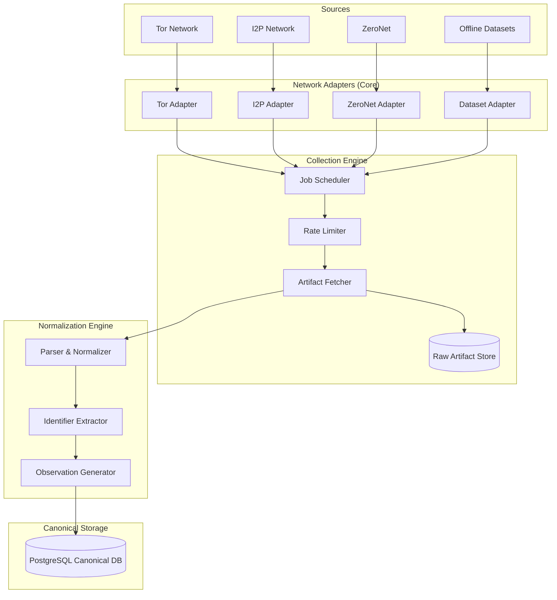

# Wolverine Intelligence - Collection Architecture Specification

This document defines the complete collection architecture for the Wolverine Intelligence platform, detailing how data flows from various networks and datasets into the canonical data model. 

> [!IMPORTANT]
> **AI is NEVER the hidden source of truth.** Every observation must trace back to a verifiable source, network adapter, or dataset. Synthetic data and AI hypotheses must explicitly declare their origins and provenance.

## 1. Collection Pipeline Architecture

The collection pipeline normalizes data from disparate sources (live networks, offline datasets, synthetic generators) into a unified canonical model.



## 2. Collection Core (`collection/core/`)

The core engine handles scheduling, orchestration, and generic lifecycle events for all collection activities.

- **Abstract Base Classes**: All adapters must implement the `NetworkAdapter` interface (see [NETWORK-ADAPTERS.md](NETWORK-ADAPTERS.md)).
- **Job Scheduling**: Distributed task queue (e.g., Celery/BullMQ) handling discovery, enumeration, and collection jobs.
- **Rate Limiting**: Enforced at the adapter level to respect network-specific semantics (e.g., per-circuit for Tor, peer-based for ZeroNet).
- **Error Handling & Retries**: Exponential backoff with jitter. Transient errors are retried; persistent errors flag the portal/source for review.
- **Progress Tracking & Logging**: Granular state machine for jobs (`QUEUED`, `RUNNING`, `PAUSED`, `COMPLETED`, `FAILED`).
- **Provenance Chain**: Cryptographically secure hash chain maintained from the initial trigger to the final PostgreSQL row.

## 3. Artifact Collection Flow

The collection lifecycle follows a strict sequence:

1. **Discovery**: Identify new portals/services (e.g., a new `.onion` domain from a known directory).
2. **Enumeration**: Map the structure and available content within a portal (e.g., scraping thread links in a forum).
3. **Collection**: Download/capture the raw content (HTML, JSON, raw binary).
4. **Storage**: Persist the raw artifact with full metadata to an immutable blob store.
5. **Normalization**: Parse the raw artifact and map it to canonical schemas.
6. **Identifier Extraction**: Run regex/NLP (non-AI deterministic extraction) to find PGP keys, cryptocurrency wallets, handles, etc.

## 4. Artifact → Observation Separation

> [!CRITICAL]
> **Artifacts and Observations are distinctly separate entities.**
> - **Artifact**: The raw, serialized object retrieved from the network (e.g., raw HTML of a forum page, JSON of a ZeroNet manifest).
> - **Observation**: A normalized, discrete fact derived from an Artifact (e.g., "User A posted Message B", "PGP Key X is associated with Email Y").

One Artifact can and usually does produce MULTIPLE Observations.

### Concrete Examples

#### A. Forum Post
- **Artifact**: `raw_html_thread_1234.html`
- **Observations**:
  1. `AUTHORSHIP`: User `dark_vendor` created Post `5678`.
  2. `REPLY`: Post `5678` is a reply to Post `1234`.
  3. `IDENTIFIER_MENTION`: Post `5678` contains BTC Wallet `1A1zP1eP5QGefi2DMPTfTL5SLmv7DivfNa`.

#### B. Marketplace Listing
- **Artifact**: `market_listing_weed_420.json`
- **Observations**:
  1. `LISTING`: Product "Super Skunk" listed at $50.
  2. `VENDOR_RELATION`: Vendor `green_thumbs` owns Product "Super Skunk".
  3. `CATEGORY_MAP`: Product "Super Skunk" categorized under `Drugs/Cannabis`.

#### C. PGP Keyserver Entry
- **Artifact**: `pgp_key_block_0xABCD1234.asc`
- **Observations**:
  1. `KEY_IDENTITY`: Key `0xABCD1234` created on 2023-01-01.
  2. `EMAIL_BINDING`: Key `0xABCD1234` claims email `vendor@darknet.onion`.

## 5. Provenance Requirements

Every Observation MUST record the following immutable fields to guarantee verifiable provenance.

| Field | Type | Required | Description |
|---|---|---|---|
| `observationId` | UUID | Yes | Immutable primary key |
| `network` | Enum | Yes | `TOR`, `I2P`, `ZERONET`, `FREENET`, `CLEARNET`, `DATASET` |
| `portal` | String | Yes | Portal/Domain identifier (e.g., `xyz.onion`) |
| `sourceLocator` | String | Yes | Exact path/URL to re-find the source |
| `sourceRecordId` | String | Yes | Upstream ID (if applicable) |
| `observationType` | Enum | Yes | `OBSERVED`, `DETERMINISTIC_MATCH`, `STATISTICAL_MATCH`, `AI_HYPOTHESIS`, `CRYPTOGRAPHIC_PROOF` |
| `observedAt` | Timestamp | Yes | Time the event occurred (if known) |
| `collectedAt` | Timestamp | Yes | Time we acquired the artifact |
| `collectorVersion` | String | Yes | SemVer of the collection adapter |
| `rawArtifactReference` | String | Yes | Pointer to the blob store artifact |
| `canonicalPayloadHash` | String | Yes | SHA-256 hash of normalized content |
| `datasetId` | UUID | No | If derived from an offline dataset |
| `scanId` | UUID | No | ID of the scanner job that found this |
| `confidence` | Float | Yes | 0.0 to 1.0 (Mutable, can be recalibrated) |
| `provenance` | JSONB | Yes | Full chain of execution context |

## 6. Deduplication Strategy

- **Artifact Deduplication**: Computed via SHA-256 hash of the raw bytes. If an identical artifact is downloaded, we update the `lastSeenAt` timestamp but do not duplicate the blob.
- **Updated Content**: If the same URL (`sourceLocator`) yields a different artifact hash, a new Artifact is stored, and new Observations are generated with the updated `collectedAt` timestamp.
- **Canonical Payload Hash**: Observations are deduplicated based on their `canonicalPayloadHash`. Identical normalized facts from the same source are merged or ignored to prevent database bloat.

## 7. Dataset Ingestion (`collection/datasets/`)

Offline datasets (e.g., leaked dumps, historical archives) are ingested using the `DatasetAdapter`.
- **Interface**: Implements `DatasetAdapter` (see [DATASETS.md](DATASETS.md)).
- **Processing**: Supports both streaming (for large NDJSON/CSV) and batch processing.
- **Schema Mapping**: Employs mapping templates to convert dataset-specific schemas to canonical observations.
- **Validation**: Strict validation rules reject malformed rows, pushing them to a dead-letter queue (DLQ) for human review.

## 8. Test Site Collection

To validate adapter functionality without hitting live threat-actor infrastructure, adapters must seamlessly target local test sites (`sites/tor/`, `sites/i2p/`, etc.). 
- The adapter must not know it is hitting a test site. It uses the exact same interface and network semantics.
- Synthetic data generated for test sites must be successfully ingested and verified against expected assertions.

## 9. Versioning

- `collectorVersion`: Tracked on every observation. Corresponds to the git tag/commit of the `NetworkAdapter`.
- `parserVersion`: Tracked alongside the `canonicalPayloadHash`. Changes in normalization logic bump this version, allowing retroactive re-parsing of historical artifacts if a bug is fixed.

## 10. Operability

### HOW TO START a collector
```bash
agy run collector --network tor --portal xyz.onion
```

### HOW TO STOP a collector
```bash
agy stop collector --job-id <uuid>
```

### HOW TO INSPECT collector state
```bash
agy status collector --job-id <uuid> --verbose
```

### HOW TO TEST a collector against test sites
```bash
agy test collector --network tor --use-local-test-sites
```

### HOW TO RESET collected data
> [!CAUTION]
> This drops all canonical observations for a given source!
```bash
agy reset portal --portal xyz.onion --confirm
```

### HOW TO TRACE one record
```bash
agy trace observation <observationId>
```
*Outputs the full provenance tree: Observation -> Extractor -> Parser -> Raw Artifact -> Fetch Job -> Discovery Event.*
