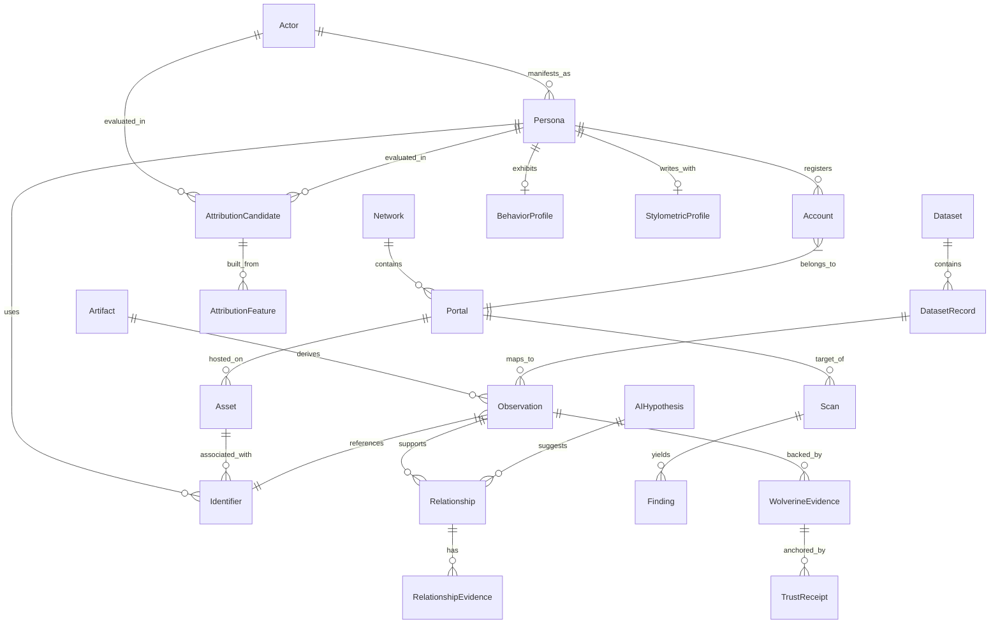

# Wolverine Intelligence Data Model Specification

> [!IMPORTANT]
> This is the MOST CRITICAL document in the entire Wolverine Intelligence specification. It defines every canonical object in the system. Any changes to this document must be reviewed by the architecture team.

## Overview

The Wolverine Intelligence platform relies on a rigorous, evidence-based data model. The core philosophy is that AI is NEVER the hidden source of truth. Every observation, relationship, and hypothesis must be fully traceable back to its origin.

> [!WARNING]
> No black-box subsystem silently determines important facts. Every relationship must cite its evidence.

## System-Wide Patterns

### Evidence Taxonomy

Every piece of evidence and relationship belongs to one of these classes:

| Class | Meaning |
|---|---|
| `OBSERVED` | Directly witnessed from network/dataset source |
| `DETERMINISTIC_MATCH` | Exact identifier reuse (e.g., same PGP key) |
| `STATISTICAL_MATCH` | Feature-based probabilistic linkage |
| `AI_HYPOTHESIS` | Generated by local AI model, requires human review |
| `CRYPTOGRAPHIC_PROOF` | Wolverine-attested, Besu-anchored |

### Temporal Semantics

Accurate time representation is crucial for threat intelligence and attribution.

- `observedAt`: When an event occurred or a fact was true in the real world (or on the network).
- `collectedAt`: When the Wolverine collector ingested the information.
- `firstSeen` / `lastSeen`: The time window during which an entity or relationship was known to exist.
- `validFrom` / `validTo`: The authorized or known validity period (e.g., for a certificate or a relationship hypothesis).

### Provenance Pattern

Every record must include provenance fields:
- `createdAt` / `updatedAt`
- `createdBy`: The identity of the system component, collector, model, or user that created the record.
- `sourceVersion`: The version of the subsystem that generated the record.

### Confidence Semantics

Confidence scores ($C$) are represented as floats between $0.0$ and $1.0$.
- $C = 1.0$: Absolute certainty (cryptographic proof or deterministic match).
- $C \geq 0.9$: High confidence (strong statistical match).
- $C \geq 0.7$: Moderate confidence (typical AI hypothesis or heuristic).
- $C < 0.7$: Low confidence (weak indicator).

$$ Confidence\_Score = \prod_{i=1}^{n} w_i \cdot f_i(evidence) $$

## Entity-Relationship Diagram

## Enumerations

- **NetworkType**: `TOR`, `I2P`, `ZERONET`, `FREENET`, `CLEARNET`
- **IdentifierType**: `HANDLE`, `PGP_KEY`, `WALLET`, `EMAIL`, `CRYPTO_ADDRESS`, `PUBLISHER_KEY`, `SITE_IDENTITY`, `DOMAIN`, `CERTIFICATE`, `OTHER`
- **ObservationType**: `POST`, `LISTING`, `MESSAGE`, `PROFILE_UPDATE`, `TRANSACTION`, `REVIEW`, `HEARTBEAT`, `KEY_EVENT`, `MIGRATION`, `SCAN_RESULT`
- **RelationshipType**: `AUTHORED`, `POSTED`, `REPLIED_TO`, `MESSAGED`, `LISTED`, `BOUGHT_FROM`, `SOLD_TO`, `REPUTATION_FOR`, `VOUCHED_FOR`, `USES_ACCOUNT`, `HAS_ALIAS`, `USES_WALLET`, `USES_PGP_KEY`, `POSSIBLE_SAME_AS`, `MIGRATED_TO`, `SHARES_INFRASTRUCTURE`, `SHARES_FINGERPRINT`, `SHARES_COUNTERPARTY`, `TEMPORALLY_CORRELATED`, `COMMUNITY_OVERLAP`, `INSTRUMENTED_BY`
- **RelationshipClass**: `OBSERVED`, `DETERMINISTIC_MATCH`, `STATISTICAL_MATCH`, `AI_HYPOTHESIS`, `ATTRIBUTION_CANDIDATE`
- **RelationshipStatus**: `PROPOSED`, `VALIDATED`, `ACTIVE`, `SUPERSEDED`, `RETRACTED`
- **FindingType**: `EXPOSURE`, `VULNERABILITY`, `FINGERPRINT`, `MISCONFIGURATION`
- **EvidenceClass**: `OBSERVED`, `DETERMINISTIC_MATCH`, `STATISTICAL_MATCH`, `AI_HYPOTHESIS`, `CRYPTOGRAPHIC_PROOF`
- **HypothesisType**: `SUMMARIZATION`, `HYPOTHESIS`, `NARRATIVE`, `PATTERN`
- **HypothesisStatus**: `GENERATED`, `REVIEWED`, `ACCEPTED`, `REJECTED`

## Object Specifications

### 1. Network
A supported overlay or clearnet network.
- **IS**: A network environment from which intelligence is collected.
- **IS NOT**: A single site or service.

| Field | Type | Req | Description | Constraints | Provenance | Mutability |
|---|---|---|---|---|---|---|
| id | uuid | Y | Primary key | PK | System | Immutable |
| name | string | Y | Network name | Unique | System | Immutable |
| type | enum | Y | NetworkType enum | - | System | Immutable |
| description | text | N | Details about the network | - | System | Mutable |
| createdAt | timestamp | Y | Record creation | - | System | Immutable |
| createdBy | string | Y | Component ID | - | System | Immutable |
| sourceVersion | string | Y | Component version | - | System | Immutable |

### 2. Portal
A specific service/site/marketplace/forum on a network.
- **IS**: A discovered service endpoint within a network.
- **IS NOT**: An actor or content item.

| Field | Type | Req | Description | Constraints | Provenance | Mutability |
|---|---|---|---|---|---|---|
| id | uuid | Y | Primary key | PK | System/Collector | Immutable |
| networkId | uuid | Y | The network it belongs to | FK (Network.id) | System/Collector | Immutable |
| address | string | Y | URL or onion address | Index | System/Collector | Mutable |
| status | string | Y | Up/Down/Archived | - | Scanner | Mutable |
| discoveredAt | timestamp | Y | When first found | - | Scanner | Immutable |
| createdAt | timestamp | Y | Record creation | - | System | Immutable |
| createdBy | string | Y | Component ID | - | System | Immutable |
| sourceVersion | string | Y | Component version | - | System | Immutable |

### 3. Asset
A piece of infrastructure (server, domain, certificate, service).
- **IS**: An addressable infrastructure component.
- **IS NOT**: Content or an actor.

| Field | Type | Req | Description | Constraints | Provenance | Mutability |
|---|---|---|---|---|---|---|
| id | uuid | Y | Primary key | PK | System/Scanner | Immutable |
| assetType | string | Y | Server, Domain, IP | - | Scanner | Immutable |
| value | string | Y | The actual value (e.g., IP address) | Index | Scanner | Immutable |
| firstSeen | timestamp | Y | - | - | Scanner | Immutable |
| createdAt | timestamp | Y | Record creation | - | System | Immutable |
| createdBy | string | Y | Component ID | - | System | Immutable |
| sourceVersion | string | Y | Component version | - | System | Immutable |

### 4. Actor
A resolved real-world entity (possibly unknown identity).
- **IS**: The system's best understanding of a distinct real-world entity.
- **IS NOT**: A username or handle (those are Personas).

| Field | Type | Req | Description | Constraints | Provenance | Mutability |
|---|---|---|---|---|---|---|
| id | uuid | Y | Primary key | PK | Analyst/AI | Immutable |
| threatLevel | float | N | Assessed threat level | Check (0.0-1.0) | Analyst/AI | Mutable |
| confidence | float | Y | Confidence in existence | Check (0.0-1.0) | Model | Mutable |
| notes | text | N | Analyst notes | - | Analyst | Mutable |
| createdAt | timestamp | Y | Record creation | - | System | Immutable |
| createdBy | string | Y | Component ID | - | System | Immutable |
| sourceVersion | string | Y | Component version | - | System | Immutable |

### 5. Persona
A specific identity presentation by an actor on a portal.
- **IS**: A particular identity used by an actor on a specific portal.
- **IS NOT**: The real person.

| Field | Type | Req | Description | Constraints | Provenance | Mutability |
|---|---|---|---|---|---|---|
| id | uuid | Y | Primary key | PK | Collector | Immutable |
| actorId | uuid | N | Linked actor | FK (Actor.id) | Analyst/AI | Mutable |
| name | string | Y | Display name | - | Collector | Mutable |
| portalId | uuid | Y | Where this persona exists | FK (Portal.id) | Collector | Immutable |
| createdAt | timestamp | Y | Record creation | - | System | Immutable |
| createdBy | string | Y | Component ID | - | System | Immutable |
| sourceVersion | string | Y | Component version | - | System | Immutable |

### 6. Account
A registered account on a portal.
- **IS**: A portal-specific registration.
- **IS NOT**: A cross-portal identity.

| Field | Type | Req | Description | Constraints | Provenance | Mutability |
|---|---|---|---|---|---|---|
| id | uuid | Y | Primary key | PK | Collector | Immutable |
| personaId | uuid | Y | Linked persona | FK (Persona.id) | Collector | Immutable |
| portalId | uuid | Y | Linked portal | FK (Portal.id) | Collector | Immutable |
| accountId | string | Y | Portal's internal ID | - | Collector | Immutable |
| registeredAt | timestamp | N | When account was created | - | Collector | Immutable |
| createdAt | timestamp | Y | Record creation | - | System | Immutable |
| createdBy | string | Y | Component ID | - | System | Immutable |
| sourceVersion | string | Y | Component version | - | System | Immutable |

### 7. Identifier
A typed identifier.
> [!NOTE]
> Identifier Model Philosophy: We use a unified identifier table with types, NOT network-specific tables (no TorUser, I2PUser). This enables cross-network pivot analysis.

| Field | Type | Req | Description | Constraints | Provenance | Mutability |
|---|---|---|---|---|---|---|
| id | uuid | Y | Primary key | PK | System | Immutable |
| type | enum | Y | IdentifierType | - | System | Immutable |
| value | string | Y | The identifier itself (e.g., PGP pub key) | Index | Collector | Immutable |
| networkId | uuid | Y | Network where observed | FK (Network.id) | Collector | Immutable |
| portalId | uuid | N | Portal where observed | FK (Portal.id) | Collector | Immutable |
| firstSeen | timestamp | Y | First observation time | Index | Collector | Immutable |
| lastSeen | timestamp | Y | Most recent observation time | Index | Collector | Mutable |
| source | string | Y | How it was found | - | Collector | Immutable |
| observationIds | uuid[] | N | Observations referencing this identifier | - | System | Mutable |
| createdAt | timestamp | Y | Record creation | - | System | Immutable |
| createdBy | string | Y | Component ID | - | System | Immutable |
| sourceVersion | string | Y | Component version | - | System | Immutable |

### 8. Artifact
The raw/serialized thing observed.
- **IS**: The original collected content.
- **IS NOT**: A normalized observation.

| Field | Type | Req | Description | Constraints | Provenance | Mutability |
|---|---|---|---|---|---|---|
| id | uuid | Y | Primary key | PK | Collector | Immutable |
| rawData | bytea | Y | The raw bytes | - | Collector | Immutable |
| hash | string | Y | SHA-256 of rawData | Unique, Index | System | Immutable |
| collectedAt | timestamp | Y | When ingested | - | Collector | Immutable |
| mimeType | string | Y | Format | - | Collector | Immutable |
| createdAt | timestamp | Y | Record creation | - | System | Immutable |
| createdBy | string | Y | Component ID | - | System | Immutable |
| sourceVersion | string | Y | Component version | - | System | Immutable |

### 9. Observation
A normalized statement derived from an artifact.
> [!TIP]
> Artifact vs Observation: An Artifact is raw HTML of a forum page. An Observation is the extracted structured data: "User X posted Message Y at Time Z".

> [!IMPORTANT]
> The Observation is the most important record in the system. It must contain enough information to reproduce how it was created. All provenance fields are immutable; only `confidence` may be recalibrated.

| Field | Type | Req | Description | Constraints | Provenance | Mutability |
|---|---|---|---|---|---|---|
| id | uuid | Y | Primary key | PK | System | Immutable |
| networkId | uuid | Y | Source network | FK (Network.id), Index | Collector | Immutable |
| portalId | uuid | Y | Source portal | FK (Portal.id), Index | Collector | Immutable |
| sourceLocator | string | Y | How to re-find the source (URL, address, key) | - | Collector | Immutable |
| sourceRecordId | string | N | Portal-internal record ID | - | Collector | Immutable |
| artifactId | uuid | Y | Source artifact | FK (Artifact.id) | System | Immutable |
| observationType | enum | Y | ObservationType | - | Parser | Immutable |
| observedAt | timestamp | Y | When the thing happened | Index | Parser | Immutable |
| collectedAt | timestamp | Y | When we collected it | Index | Collector | Immutable |
| collectorVersion | string | Y | Version of collector that ingested | - | Collector | Immutable |
| rawArtifactReference | string | Y | Storage reference to raw artifact | - | Collector | Immutable |
| canonicalPayloadHash | string | Y | SHA-256 of normalized content | Unique, Index | System | Immutable |
| datasetId | uuid | N | If from a dataset | FK (Dataset.id) | Adapter | Immutable |
| scanId | uuid | N | If from a scanner | FK (Scan.id) | Scanner | Immutable |
| confidence | float | Y | Observation confidence | Check (0.0-1.0) | Parser/Model | **Mutable** |
| provenance | jsonb | Y | Full provenance chain | - | System | Immutable |
| createdAt | timestamp | Y | Record creation | - | System | Immutable |
| createdBy | string | Y | Component ID | - | System | Immutable |
| sourceVersion | string | Y | Component version | - | System | Immutable |

### 10. Relationship
A graph edge between two entities.

> [!NOTE]
> Relationships MUST specify their class (OBSERVED, DETERMINISTIC_MATCH, STATISTICAL_MATCH, AI_HYPOTHESIS, ATTRIBUTION_CANDIDATE). Classes are NEVER collapsed.

| Field | Type | Req | Description | Constraints | Provenance | Mutability |
|---|---|---|---|---|---|---|
| id | uuid | Y | Primary key | PK | System | Immutable |
| sourceId | uuid | Y | Source entity ID | Index | System | Immutable |
| targetId | uuid | Y | Target entity ID | Index | System | Immutable |
| type | enum | Y | RelationshipType | - | Model/Analyst | Immutable |
| class | enum | Y | RelationshipClass | - | System | Immutable |
| observedAt | timestamp | N | When relationship was observed | - | System | Immutable |
| confidence | float | Y | 0.0 to 1.0 | Check (0.0-1.0) | Model/Analyst | Mutable |
| status | enum | Y | RelationshipStatus | - | Analyst | Mutable |
| validFrom | timestamp | N | Known validity start | - | System | Mutable |
| validTo | timestamp | N | Known validity end | - | System | Mutable |
| sourceObservationIds | uuid[] | N | Observations that support this | - | System | Mutable |
| evidenceIds | uuid[] | N | RelationshipEvidence records | - | System | Mutable |
| modelVersion | string | N | Attribution model version used | - | Model | Immutable |
| createdAt | timestamp | Y | Record creation | - | System | Immutable |
| createdBy | string | Y | Component ID | - | System | Immutable |
| sourceVersion | string | Y | Component version | - | System | Immutable |

### 11. RelationshipEvidence
Supporting evidence for a relationship.

| Field | Type | Req | Description | Constraints | Provenance | Mutability |
|---|---|---|---|---|---|---|
| id | uuid | Y | Primary key | PK | System | Immutable |
| relationshipId | uuid | Y | The edge | FK (Relationship.id) | System | Immutable |
| evidenceClass | enum | Y | EvidenceClass | - | System | Immutable |
| referenceId | uuid | Y | Observation/Artifact ID | - | System | Immutable |
| createdAt | timestamp | Y | Record creation | - | System | Immutable |
| createdBy | string | Y | Component ID | - | System | Immutable |
| sourceVersion | string | Y | Component version | - | System | Immutable |

### 12. InfrastructureIndicator
A discovered infrastructure characteristic.

| Field | Type | Req | Description | Constraints | Provenance | Mutability |
|---|---|---|---|---|---|---|
| id | uuid | Y | Primary key | PK | Scanner | Immutable |
| assetId | uuid | Y | Linked asset | FK (Asset.id) | Scanner | Immutable |
| key | string | Y | Indicator name | - | Scanner | Immutable |
| value | jsonb | Y | Indicator details | - | Scanner | Mutable |
| createdAt | timestamp | Y | Record creation | - | System | Immutable |
| createdBy | string | Y | Component ID | - | System | Immutable |
| sourceVersion | string | Y | Component version | - | System | Immutable |

### 13. Scan
A scanner execution record.

| Field | Type | Req | Description | Constraints | Provenance | Mutability |
|---|---|---|---|---|---|---|
| id | uuid | Y | Primary key | PK | Scanner | Immutable |
| portalId | uuid | N | Target portal | FK | Scanner | Immutable |
| startedAt | timestamp | Y | - | - | Scanner | Immutable |
| finishedAt | timestamp | N | - | - | Scanner | Mutable |
| version | string | Y | Scanner version | - | Scanner | Immutable |
| createdAt | timestamp | Y | Record creation | - | System | Immutable |
| createdBy | string | Y | Component ID | - | System | Immutable |
| sourceVersion | string | Y | Component version | - | System | Immutable |

### 14. Finding
A specific scanner finding.

| Field | Type | Req | Description | Constraints | Provenance | Mutability |
|---|---|---|---|---|---|---|
| id | uuid | Y | Primary key | PK | Scanner | Immutable |
| scanId | uuid | Y | Linked scan | FK (Scan.id) | Scanner | Immutable |
| type | enum | Y | FindingType | - | Scanner | Immutable |
| details | jsonb | Y | Vulnerability info | - | Scanner | Immutable |
| createdAt | timestamp | Y | Record creation | - | System | Immutable |
| createdBy | string | Y | Component ID | - | System | Immutable |
| sourceVersion | string | Y | Component version | - | System | Immutable |

### 15. AttributionCandidate
A potential link between two entities with scoring.

| Field | Type | Req | Description | Constraints | Provenance | Mutability |
|---|---|---|---|---|---|---|
| id | uuid | Y | Primary key | PK | AI Model | Immutable |
| entityA | uuid | Y | - | - | AI Model | Immutable |
| entityB | uuid | Y | - | - | AI Model | Immutable |
| score | float | Y | Probability | Check | AI Model | Mutable |
| modelVersion | string | Y | - | - | AI Model | Immutable |
| createdAt | timestamp | Y | Record creation | - | System | Immutable |
| createdBy | string | Y | Component ID | - | System | Immutable |
| sourceVersion | string | Y | Component version | - | System | Immutable |

### 16. AttributionFeature
Individual feature values for an attribution candidate.

| Field | Type | Req | Description | Constraints | Provenance | Mutability |
|---|---|---|---|---|---|---|
| id | uuid | Y | Primary key | PK | AI Model | Immutable |
| candidateId | uuid | Y | FK | FK (AttributionCandidate.id)| AI Model | Immutable |
| featureName | string | Y | E.g., 'time_overlap' | - | AI Model | Immutable |
| value | float | Y | - | - | AI Model | Immutable |
| createdAt | timestamp | Y | Record creation | - | System | Immutable |
| createdBy | string | Y | Component ID | - | System | Immutable |
| sourceVersion | string | Y | Component version | - | System | Immutable |

### 17. BehaviorProfile
Behavioral characteristics of a persona/actor.

| Field | Type | Req | Description | Constraints | Provenance | Mutability |
|---|---|---|---|---|---|---|
| id | uuid | Y | Primary key | PK | System | Immutable |
| personaId | uuid | Y | FK | FK (Persona.id) | System | Immutable |
| timezone | string | N | Estimated TZ | - | AI Model | Mutable |
| activeHours | jsonb | N | Hourly activity heat | - | AI Model | Mutable |
| createdAt | timestamp | Y | Record creation | - | System | Immutable |
| createdBy | string | Y | Component ID | - | System | Immutable |
| sourceVersion | string | Y | Component version | - | System | Immutable |

### 18. StylometricProfile
Writing style characteristics.

| Field | Type | Req | Description | Constraints | Provenance | Mutability |
|---|---|---|---|---|---|---|
| id | uuid | Y | Primary key | PK | System | Immutable |
| personaId | uuid | Y | FK | FK (Persona.id) | System | Immutable |
| wordFreq | jsonb | Y | Token frequencies | - | AI Model | Mutable |
| grammarPats | jsonb | Y | Structural quirks | - | AI Model | Mutable |
| createdAt | timestamp | Y | Record creation | - | System | Immutable |
| createdBy | string | Y | Component ID | - | System | Immutable |
| sourceVersion | string | Y | Component version | - | System | Immutable |

### 19. TimelineEvent
A time-stamped event for timeline reconstruction.

| Field | Type | Req | Description | Constraints | Provenance | Mutability |
|---|---|---|---|---|---|---|
| id | uuid | Y | Primary key | PK | System | Immutable |
| entityId | uuid | Y | Actor/Persona ID | - | System | Immutable |
| eventType | string | Y | - | - | System | Immutable |
| eventTime | timestamp | Y | - | - | System | Immutable |
| createdAt | timestamp | Y | Record creation | - | System | Immutable |
| createdBy | string | Y | Component ID | - | System | Immutable |
| sourceVersion | string | Y | Component version | - | System | Immutable |

### 20. Dataset
A registered external dataset.

| Field | Type | Req | Description | Constraints | Provenance | Mutability |
|---|---|---|---|---|---|---|
| id | uuid | Y | Primary key | PK | System | Immutable |
| name | string | Y | - | Unique | System | Immutable |
| sourceUrl | string | N | Where it came from | - | System | Immutable |
| hash | string | Y | Data integrity check | - | System | Immutable |
| createdAt | timestamp | Y | Record creation | - | System | Immutable |
| createdBy | string | Y | Component ID | - | System | Immutable |
| sourceVersion | string | Y | Component version | - | System | Immutable |

### 21. DatasetRecord
A record mapping from dataset to canonical model.

| Field | Type | Req | Description | Constraints | Provenance | Mutability |
|---|---|---|---|---|---|---|
| id | uuid | Y | Primary key | PK | System | Immutable |
| datasetId | uuid | Y | FK | FK (Dataset.id) | System | Immutable |
| rawRecord | jsonb | Y | Original entry | - | System | Immutable |
| createdAt | timestamp | Y | Record creation | - | System | Immutable |
| createdBy | string | Y | Component ID | - | System | Immutable |
| sourceVersion | string | Y | Component version | - | System | Immutable |

### 22. ModelVersion
A registered ML model version with metadata.

| Field | Type | Req | Description | Constraints | Provenance | Mutability |
|---|---|---|---|---|---|---|
| id | uuid | Y | Primary key | PK | System | Immutable |
| modelName | string | Y | - | - | System | Immutable |
| versionTag | string | Y | E.g., 'v1.2.0' | - | System | Immutable |
| parameters | jsonb | N | Hyperparams | - | System | Immutable |
| createdAt | timestamp | Y | Record creation | - | System | Immutable |
| createdBy | string | Y | Component ID | - | System | Immutable |
| sourceVersion | string | Y | Component version | - | System | Immutable |

### 23. AIHypothesis
An AI-generated hypothesis with references.

| Field | Type | Req | Description | Constraints | Provenance | Mutability |
|---|---|---|---|---|---|---|
| id | uuid | Y | Primary key | PK | AI Model | Immutable |
| summary | string | Y | Human readable idea | - | AI Model | Mutable |
| modelId | uuid | Y | Model used | FK (ModelVersion.id) | AI Model | Immutable |
| status | string | Y | Pending/Reviewed | - | Analyst | Mutable |
| createdAt | timestamp | Y | Record creation | - | System | Immutable |
| createdBy | string | Y | Component ID | - | System | Immutable |
| sourceVersion | string | Y | Component version | - | System | Immutable |

### 24. WolverineEvidence
A cryptographic evidence record.

| Field | Type | Req | Description | Constraints | Provenance | Mutability |
|---|---|---|---|---|---|---|
| id | uuid | Y | Primary key | PK | System | Immutable |
| observationId | uuid | Y | Tied observation | FK (Observation.id) | System | Immutable |
| signature | string | Y | Crypto sig | - | Signing Service | Immutable |
| createdAt | timestamp | Y | Record creation | - | System | Immutable |
| createdBy | string | Y | Component ID | - | System | Immutable |
| sourceVersion | string | Y | Component version | - | System | Immutable |

### 25. TrustReceipt
A Besu-anchored trust receipt.

| Field | Type | Req | Description | Constraints | Provenance | Mutability |
|---|---|---|---|---|---|---|
| id | uuid | Y | Primary key | PK | Ledger | Immutable |
| evidenceId | uuid | Y | FK | FK(WolverineEvidence.id)| Ledger | Immutable |
| blockHash | string | Y | Anchor point | - | Besu Node | Immutable |
| transactionId | string| Y | Chain tx hash | Unique | Besu Node | Immutable |
| createdAt | timestamp | Y | Record creation | - | System | Immutable |
| createdBy | string | Y | Component ID | - | System | Immutable |
| sourceVersion | string | Y | Component version | - | System | Immutable |
