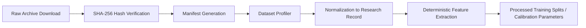

# Wolverine Intelligence — Dataset Ingestion & Profiling Specification

## 1. Ingestion Pipeline

The ingestion pipeline transforms raw external research corpora into verified, profiled, and normalized feature artifacts within **Domain A (Research Data Lake)**:

---

## 2. Profiling Engine Specification

The profiling tool (`scripts/dataset_profile.ts`) computes:
1. **Document/Row Counts**: Exact record totals per table/fixture.
2. **Schema & Field Types**: Inferred types (string, number, boolean, object, ISO8601 timestamp).
3. **Null Rates**: Proportion of missing or null fields ($R_{\text{null}} \in [0.0, 1.0]$).
4. **Text Length Metrics**: Min, max, mean character counts across listing descriptions and forum posts.
5. **Temporal Spans**: Earliest and latest timestamps for chronological validation.

---

## 3. Dataset Verification Tooling

- **Status Check**: `npm run dataset:status`
- **Integrity Verification**: `npm run dataset:verify` (Validates 100% of tracked files against `manifest.json` SHA-256 hashes)
- **Profile Generation**: `npm run dataset:profile` (Outputs `.profile.json` to dataset `reports/` folder)
- **Feature Extraction**: `npm run features:extract` (Extracts deterministic feature matrices)
