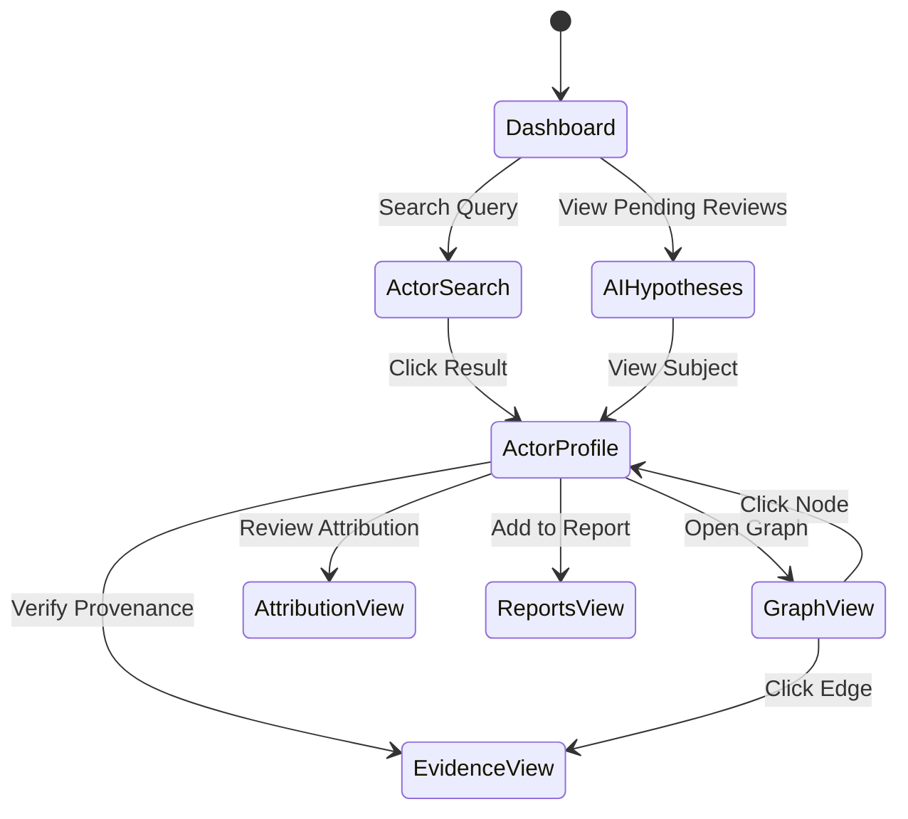

# Wolverine Intelligence Frontend Specification

> [!IMPORTANT]
> This document defines the frontend view specifications for Wolverine Intelligence. The primary directive is that the UI must never hide the source of information. Every data point must be clickable to trace its provenance.

## 1. Frontend Philosophy

1.  **Analyst-Centric Workflow:** Designed around the investigative process of threat intelligence analysts.
2.  **Visual Distinction:** Must visually distinguish evidence classes at a glance.
3.  **Provenance Tracing:** Users can click on any edge, node, or attribute to view the raw observation or cryptographic receipt that backs it.
4.  **No AI Black Boxes:** AI-generated content is heavily badged, isolated, and requires explicit human review workflows.

## 2. Evidence Class Visual System

The frontend component library must implement this exact visual system for styling cards, edges, badges, and list items.

| Class | Color | Badge | Visual Treatment (Borders/Lines) |
|---|---|---|---|
| `OBSERVED` | Green (`#22c55e`) | ✅ | Solid border / Solid line |
| `DETERMINISTIC_MATCH` | Blue (`#3b82f6`) | 🔗 | Solid border, bold / Thick solid line |
| `STATISTICAL_MATCH` | Orange (`#f97316`) | 📊 | Dashed border / Dashed line |
| `AI_HYPOTHESIS` | Purple (`#a855f7`) | 🤖 | Dotted border, italic text / Dotted line |
| `CRYPTOGRAPHIC_PROOF` | Gold (`#eab308`) | 🔐 | Double border / Double line |

## 3. Primary Views

### 3.1 Dashboard
The landing page providing system health and global intelligence overviews.
*   **Components:** Summary statistics cards (observations, actors, relationships categorized by class), Recent Activity Feed, System Health indicators (DB, Blockchain, Collectors).
*   **Data Sources:** `GET /api/v1/stats`, `GET /api/v1/timeline/events`

### 3.2 Actor Search
Interface to find specific threat actors or personas.
*   **Components:** Search bar (Name, Identifier, Network), Faceted Filtering sidebar (Network, Confidence, Relationship Class). Results DataGrid with evidence class indicators.
*   **Data Sources:** `GET /api/v1/actors/search`

### 3.3 Actor Profile
The comprehensive 360-degree view of a single actor.
*   **Components:**
    *   **Identity Summary:** Lists personas, identifiers, and linked accounts.
    *   **Relationship Graph:** Interactive miniature network graph.
    *   **Timeline View:** Chronological activity.
    *   **Attribution Candidates:** List of potential matches with scores and evidence breakdown.
    *   **AI Hypotheses:** Specifically cordoned section, clearly marked with 🤖.
    *   **Behavioral & Stylometric Profiles:** Radar charts of habits/linguistics.
    *   **Verification Status:** Wolverine cryptographic verification badge.
*   **Data Sources:** `GET /api/v1/actors/:id`, `/personas`, `/identifiers`, `/relationships`, `/timeline`, `/attribution`, `/hypotheses`

### 3.4 Graph View
Fullscreen interactive graph for link analysis.
*   **Components:** 
    *   **Canvas:** Force-directed graph rendering.
    *   **Nodes:** Actor, Persona, Asset, Portal.
    *   **Edges:** Colored and styled strictly according to the **Evidence Class Visual System**.
    *   **Filters:** Filter out low-confidence paths or specific evidence classes (e.g., hide all AI hypotheses).
*   **Data Sources:** `GET /api/v1/graph/subgraph`, `GET /api/v1/graph/neighbors`

### 3.5 Timeline View
Chronological investigation tool.
*   **Components:** Infinite-scroll event stream, swimlanes for different networks or entities, rebranding/migration visualization (showing when an actor shifted from one persona/network to another).
*   **Data Sources:** `GET /api/v1/timeline/events`, `GET /api/v1/timeline/activity`

### 3.6 Infrastructure View
Managing cyber assets and IOCs.
*   **Components:** Asset inventory table, Indicator display with category badges (IP, Domain, ASN), Scan history timeline, Cross-asset relationship visualization.
*   **Data Sources:** `GET /api/v1/infrastructure/assets`, `/indicators`, `/scans`

### 3.7 Attribution View
Deep-dive into why two entities are linked.
*   **Components:** 
    *   Candidate pair comparison.
    *   Feature Radar Chart/Bar Chart showing matching dimensions (e.g., timezone, PGP overlap, stylometrics).
    *   Confidence Gauge with calibration context (e.g., "95% confidence based on model v2.1").
    *   Evidence Chain display detailing exactly which observations led to the match.
*   **Data Sources:** `GET /api/v1/attribution/candidates`, `/evidence`

### 3.8 Evidence View
Cryptographic validation interface.
*   **Components:** Wolverine verification interface (enter an ID, see its Merkle proof), Trust receipt display (JSON viewer for Besu receipts), Integrity audit results table.
*   **Data Sources:** `GET /api/v1/evidence/verify`, `GET /api/v1/evidence/receipt`

### 3.9 AI Hypotheses View
Workflow for reviewing AI-generated connections.
*   **Components:** 
    *   Hypothesis list with Kanban-style status (GENERATED, REVIEWED, ACCEPTED, REJECTED).
    *   Rich-text display of the hypothesis with linked referenced entities.
    *   Review workflow buttons (Accept/Reject/Modify).
    *   Clear `AI_HYPOTHESIS` badge enforced globally.
*   **Data Sources:** `GET /api/v1/ai/hypotheses`, `PATCH /api/v1/ai/hypotheses/:id`

### 3.10 Scans View
*   **Components:** Scan job management board, Results browser, Finding detail pane.
*   **Data Sources:** `GET /api/v1/scans`, `POST /api/v1/scans`

### 3.11 Reports & Exports Views
*   **Components:** Report builder (drag-and-drop elements from investigation), Template selection, Preview pane, Export history table.
*   **Data Sources:** `POST /api/v1/export/*`

## 4. UI Flow Architecture

## 5. Technology Stack Requirements
*   **Framework:** React + TypeScript.
*   **State Management:** Redux or Zustand (must maintain strict immutability of fetched evidence).
*   **Graph Library:** Cytoscape.js or React Force Graph (must support custom edge rendering for dashed/dotted lines).
*   **Versioning:** Frontend package version must be displayed in the application footer alongside API compatibility versions.

See [API-CONTRACT.md](API-CONTRACT.md) for data payloads consumed by these views.
