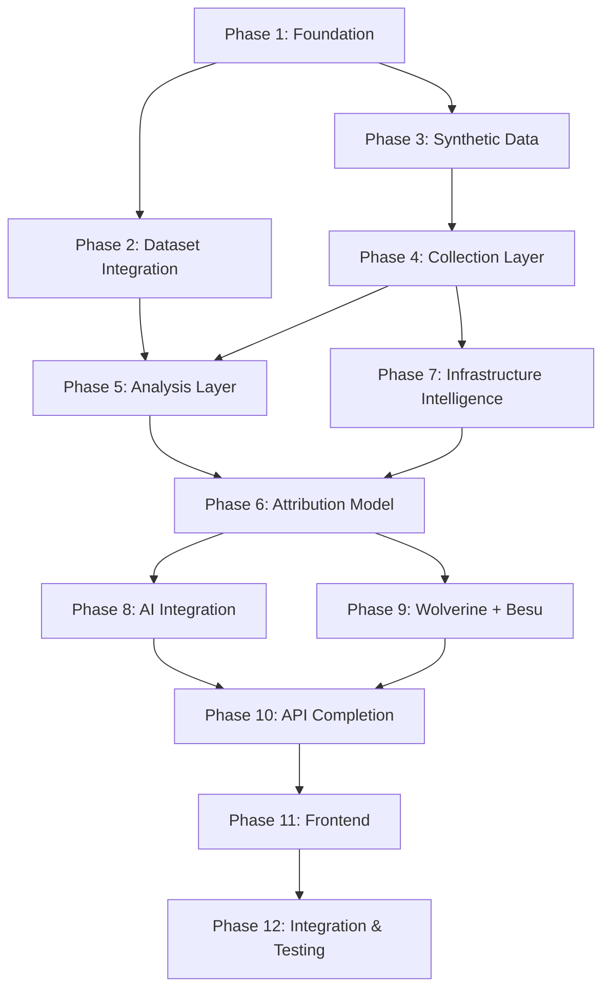

# Wolverine Intelligence - Implementation Roadmap

## 1. Implementation Phases

The construction of Wolverine Intelligence follows a strict, dependency-ordered phase plan.

### Phase 1: Foundation (2-3 days)
- PostgreSQL + Prisma schema setup
- Core data model implementation (Actor, Persona, Observation)
- Database migrations tracking
- Seed data generation for base tables
- Basic API scaffold setup

### Phase 2: Dataset Integration (2-3 days)
- Dataset adapters for historic breaches (Evolution, VeriDark)
- Dataset ingestion pipeline architecture
- Canonical observation creation from raw datasets
- Validation tests ensuring dataset integrity

### Phase 3: Synthetic Data (3-4 days)
- Distribution analysis from real datasets to establish baselines
- Persona generator implementation
- Activity/post generator implementation
- Population generator (with deterministic seeds)
- Test site HTML content generation

### Phase 4: Collection Layer (5-7 days)
- `NetworkAdapter` interface base implementation
- Test site implementations (`sites/tor/`, `sites/i2p/`, etc.)
- TorAdapter, I2PAdapter, ZeroNetAdapter, FreenetAdapter, ClearnetAdapter
- Collector → raw artifact → canonical observation pipeline

### Phase 5: Analysis Layer (4-5 days)
- Stylometric feature extraction logic
- Behavior profile computation engine
- Identity matching features (exact identifiers)
- Graph feature computation (centrality, degrees)
- Entity resolution base logic

### Phase 6: Attribution Model (3-4 days)
- Feature vector assembly from Analysis Layer outputs
- Training data preparation (combining synthetic + ground-truth datasets)
- Logistic regression model training
- Probability calibration (Platt scaling)
- Model evaluation and metric reporting

### Phase 7: Infrastructure Intelligence (2-3 days)
- Scanner adapter implementations (Nmap, Shodan analogs)
- Finding normalization into structured schema
- Infrastructure indicator pipeline and correlation

### Phase 8: AI Integration (2-3 days)
- MiniCPM5 container setup and API wrapping
- Hypothesis generation pipeline configuration
- Prompt guardrails and deterministic constraints
- Human review workflow integration
> [!IMPORTANT]
> AI is NEVER the hidden source of truth. All hypotheses require human validation and are marked as `AI_HYPOTHESIS`.

### Phase 9: Wolverine + Besu (3-4 days)
- Canonicalization algorithm for observations
- Merkle tree construction for batch attestation
- Cryptographic attestation logic
- Besu smart contract deployment and integration
- Verification pipeline

### Phase 10: API Completion (3-4 days)
- Finalize all REST/GraphQL API endpoints
- Standardize query semantics and filtering
- Export functionality (CSV, JSON, STIX)

### Phase 11: Frontend (5-7 days)
- React frontend views and routing
- Evidence class visual system (color coding by taxonomy)
- Interactive force-directed graph for relationships
- Temporal analysis timeline views

### Phase 12: Integration & Testing (3-4 days)
- End-to-end trace tests
- Reproducibility verification
- Performance tuning (DB indexing, caching)
- Documentation finalization

## 2. Master Trace Example

This trace follows ONE canonical example through the entire system to prove subsystem interaction.

**SCENARIO**: 
- A vendor "DarkPhoenix" operates on a Tor marketplace (test site).
- The same vendor appears as "Ph0enixRising" on an I2P forum (test site).

**Trace Timeline**:
1. **Raw Artifact**: Tor collector crawls test site, discovers marketplace listing by "DarkPhoenix".
2. **Canonical Observation**: The raw HTML artifact is parsed and normalized into an Observation record.
3. **Identifiers Extracted**: `HANDLE:DarkPhoenix`, `PGP_KEY:0xABCD`, `WALLET:bc1q...` are stored.
4. **Second Source**: I2P collector crawls forum test site, discovers post by "Ph0enixRising" containing the *exact same* PGP key.
5. **Entity Resolution**: System detects shared PGP key, creating a `DETERMINISTIC_MATCH` relationship.
6. **Relationships Created**: `USES_PGP_KEY`, `HAS_ALIAS`, `POSSIBLE_SAME_AS` edges added to graph.
7. **Feature Vector Assembled**: For the pair (DarkPhoenix, Ph0enixRising):
   `[alias=0.62, pgp=1.0, wallet=0.0, stylometry=0.78, behavior=0.65, temporal=0.71, graph=0.45, market=0.0, infrastructure=0.33, migration=0.58]`
8. **Attribution Model**: Logistic regression calculates $z = \beta_0 + \sum \beta_i x_i \rightarrow P(link) = 0.94$.
9. **Calibrated Confidence**: After Platt scaling, final probability is $0.91$.
10. **AI Hypothesis**: MiniCPM5 (triggered by high probability) generates: *"DarkPhoenix and Ph0enixRising likely same actor based on shared PGP key and similar writing patterns. Recommend verifying wallet activity."*
11. **Wolverine Evidence**: Both observations and the relationship are canonicalized to JSON and hashed.
12. **Merkle Root**: System computes batch root $Root = H(H(obs_1) || H(obs_2) || ...)$.
13. **Besu Anchoring**: Merkle root is anchored to the local Besu node; a cryptographic `trust_receipt` is created.
14. **Analyst UI**: Analyst views the "Actor Profile", seeing both personas linked, the evidence chain, the 91% confidence score, the AI hypothesis marked with a 🤖 icon, and the Wolverine verification marked with a 🔐 icon.

## 3. Self-Check Verification Matrix

| Question | Document | Section |
|---|---|---|
| What exactly is an actor? | DATA-MODEL.md | Actor |
| What exactly is a persona? | DATA-MODEL.md | Persona |
| What exactly is an observation? | DATA-MODEL.md | Observation |
| What exactly is a relationship? | DATA-MODEL.md + RELATIONSHIP-MODEL.md | Relationship |
| What exact features generate a relationship candidate? | ATTRIBUTION-MATH.md | Feature Vector Definition |
| What mathematical equation produces attribution probability? | ATTRIBUTION-MATH.md | Mathematical Model |
| Where do the coefficients come from? | ATTRIBUTION-MATH.md | Training Specification |
| How is probability calibrated? | ATTRIBUTION-MATH.md | Confidence Calibration |
| How do we detect a migrated persona? | BEHAVIOR-MODEL.md + ATTRIBUTION-MATH.md | Migration |
| How do we identify infrastructure reuse? | INFRASTRUCTURE-INTELLIGENCE.md | Infrastructure Comparison |
| How do the Tor/I2P/ZeroNet/Freenet collectors differ? | NETWORK-ADAPTERS.md | Per-Adapter Specifications |
| How does each become one canonical observation? | COLLECTION.md | Artifact → Observation |
| Where does the data live? | DATABASE.md | Complete ER Model |
| How do I open the database? | DATABASE.md | Developer Operability |
| What exactly does Wolverine hash? | WOLVERINE.md | Canonicalization |
| How is the Merkle root generated? | WOLVERINE.md | Merkle Construction |
| What exactly is written to Besu? | WOLVERINE.md | Besu Integration |
| How do I prove tampering? | TAMPER-VERIFICATION.md | Four Independent Integrity Checks |
| What does AI do? | AI.md | Allowed Uses |
| What does AI NOT do? | AI.md | Disallowed Uses |
| How do I reproduce the entire system? | REPRODUCIBILITY.md | Setup Procedure |
| What exactly gets tested? | TEST-STRATEGY.md | Test Categories |

## 4. Dependency Graph

