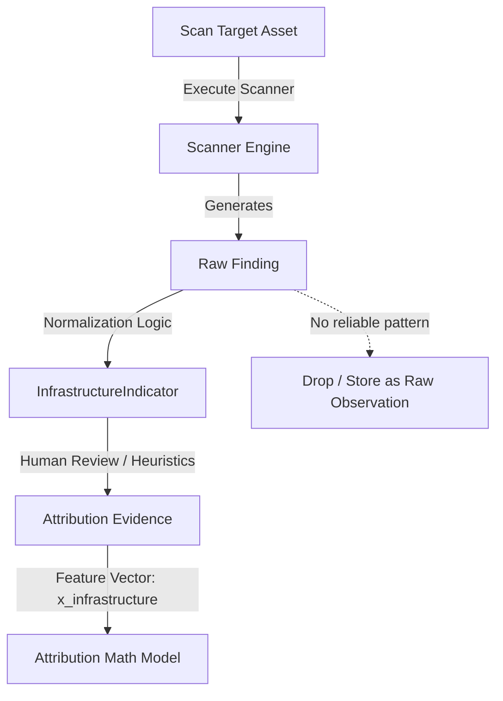

# Wolverine Intelligence: Infrastructure Intelligence Subsystem

> [!IMPORTANT]
> **SYSTEM BOUNDARY RULE**: AI is NEVER the hidden source of truth in infrastructure mapping. A raw scanner output cannot automatically become an attribution fact. Findings MUST go through normalization to create a human-reviewable indicator before acting as evidence.

This document defines the infrastructure intelligence subsystem for the Wolverine platform, standardizing how external technical assets are scanned, mapped, and mathematically compared for attribution.

See also: [SCANNER-ARCHITECTURE.md](SCANNER-ARCHITECTURE.md), [ATTRIBUTION-MATH.md](ATTRIBUTION-MATH.md).

---

## 1. Core Objects

| Object | Description | Storage Table |
|---|---|---|
| **Asset** | An addressable infrastructure component (e.g., server IP, domain, tor hidden service, TLS certificate). | `infra_assets` |
| **Scan** | A point-in-time execution of a specific scanner (e.g., Nmap, Nuclei) against a target Asset. | `infra_scans` |
| **Finding** | A specific, raw scanner result (e.g., an exposed port, a raw HTTP response body, a CVE match). | `infra_findings` |
| **InfrastructureIndicator** | A normalized, human-reviewable characteristic derived from a Finding (e.g., specific TLS cert hash, HTTP header pattern). | `infra_indicators` |

---

## 2. Indicator Categories

Every `InfrastructureIndicator` must map to a standardized category to feed into the attribution feature vector (`infrastructure`).

| Category | What it is | Example | Attribution relevance |
|---|---|---|---|
| `TLS_CERTIFICATE` | Certificate details and hashes | Same cert on two hidden services | Strong (`DETERMINISTIC_MATCH` if identical) |
| `DOMAIN_REFERENCE` | Cross-domain references | Darkweb forum linking to same clearnet domain | Medium |
| `HTTP_HEADERS` | Server header patterns | Same sequence of custom or non-standard headers | Medium |
| `SERVER_FINGERPRINT`| OS/server identification | Specific nginx version + unique config profile | Low-Medium |
| `FAVICON` | Favicon hash (MurmurHash3) | Identical favicon hash across disconnected sites | Medium-Strong |
| `STATIC_ASSETS` | JS/CSS/image hashes | Same custom obfuscated JS bundle | Strong |
| `TECH_STACK` | Framework detection | Same unusual technology combination (e.g., esoteric PHP framework) | Low-Medium |
| `SERVICE_BANNER` | Network service banners | Custom SSH banner string | Medium |
| `METADATA_LEAKAGE` | Unintentional data exposure | Author name in HTML comments or EXIF data | Strong |
| `CLEARNET_RELATION` | Links to clearnet IPs/DNS | Backend IP leak, clearnet API calls | Very Strong |
| `DNS_RELATIONSHIP` | DNS record connections | Same historical nameserver or WHOIS registrant | Medium |
| `EXPOSED_ADMIN` | Administrative interfaces | Exposed PhpMyAdmin panel | Medium (circumstantial) |
| `MISCONFIGURATION` | Security misconfiguration | Directory listing enabled revealing identical folder structures | Low (common) |
| `KNOWN_VULN` | Known CVE presence | Specific CVE match (e.g., old vBulletin exploit) | Low (attribution), High (tactical) |

---

## 3. Scanner $\rightarrow$ Indicator Pipeline

To ensure absolute data provenance, the flow of data from scanning an asset to asserting an infrastructure link is strictly gated.

> [!CAUTION]
> Never map a `Finding` directly to an `Attribution Fact`. It must pass through the `InfrastructureIndicator` normalization layer so analysts can audit the interpretation of the raw data.

### Pipeline Rules:
1.  **Scanner execution** produces raw `Finding`s.
2.  **Normalization adapters** evaluate the `Finding`. If it matches a known, stable pattern (like a TLS certificate hash), it is extracted into an `InfrastructureIndicator`.
3.  **Evidence Linking**: If two distinct personas/assets share the exact same `InfrastructureIndicator`, a `STATISTICAL_MATCH` or `DETERMINISTIC_MATCH` is recorded.

---

## 4. Infrastructure Comparison

When assessing whether Persona A and Persona B share infrastructure, the subsystem calculates an infrastructure similarity score $x_{infra} \in [0,1]$.

The comparison leverages a feature vector approach specifically for the indicators:

1.  Let $I_A$ be the set of `InfrastructureIndicators` for Persona A's assets.
2.  Let $I_B$ be the set of `InfrastructureIndicators` for Persona B's assets.
3.  Let $S = I_A \cap I_B$ be the shared indicators.

The similarity score is computed by summing the predefined **Attribution Relevance Weights** ($w_c$) for the categories of the shared indicators, bounded at 1.0:

$$x_{infra} = \min\left(1.0, \sum_{i \in S} w_{\text{category}(i)}\right)$$

*Example Weights:*
*   `TLS_CERTIFICATE` (Identical): 1.0
*   `METADATA_LEAKAGE`: 0.8
*   `FAVICON`: 0.6
*   `SERVER_FINGERPRINT`: 0.2

*Note: If an AI flags a potential infrastructure anomaly, it creates an `AI_HYPOTHESIS` indicator which carries a strict $w \le 0.1$ until corroborated.*

---

## 5. Operability

*   **HOW TO START A SCAN**: Use `agy scan start --target <asset_id> --profile deep`.
*   **HOW TO INSPECT FINDINGS**: Use `agy scan view <scan_id>` to view raw JSON outputs.
*   **HOW TO TRACE INDICATORS**: Use `agy trace indicator <indicator_id>` to see every raw `Finding` and `Asset` that generated this specific indicator.
*   **HOW TO RESET PIPELINE**: Run `agy scan reset --asset <asset_id>` to clear derived indicators and force a re-normalization of historical raw findings.
