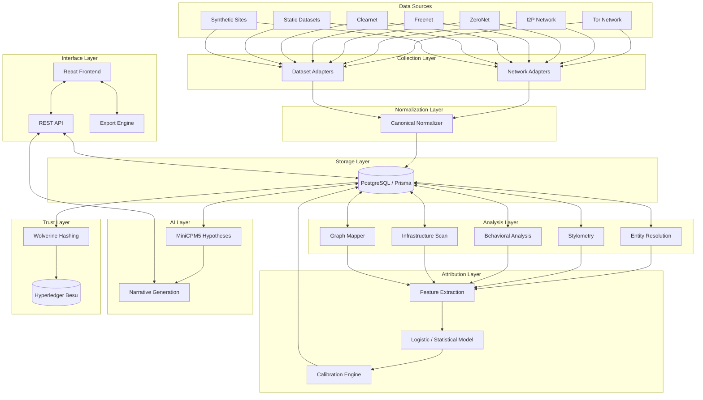

# MASTER ARCHITECTURE SPECIFICATION
**Wolverine Intelligence Platform**

This document specifies the master architecture, layer decomposition, and non-negotiable design laws of the Wolverine Intelligence platform.

## 1. System Overview

## 2. Layer Decomposition

- **Collection Layer:** Comprises network adapters that respect each network's native semantics (e.g., Tor vs. I2P) and dataset adapters. Responsible for ingesting raw data without altering its fundamental structure.
- **Normalization Layer:** Converts raw artifacts into canonical `OBSERVED` facts (Observations). Maps disparate raw structures into a unified schema for downstream processing.
- **Storage Layer:** PostgreSQL database managed by Prisma ORM. It serves as the immutable ledger for observations and the state store for derived relationships.
- **Analysis Layer:** Generates features and discrete deterministic facts. 
  - *Entity Resolution:* Finds `DETERMINISTIC_MATCH` data (PGP keys, crypto addresses).
  - *Stylometry & Behavior:* Quantifies textual and action-oriented patterns.
  - *Infrastructure & Graph:* Maps topological connections.
- **Attribution Layer:** Computes `STATISTICAL_MATCH` probabilities by combining feature vectors via calibrated logistic or probabilistic models.
- **AI Layer:** Utilizes local MiniCPM5 models to analyze the graph and generate `AI_HYPOTHESIS` data. Also generates human-readable narratives. It operates strictly on database entities and is heavily sandboxed.
- **Trust Layer:** Implements Wolverine hashing and Merkle trees to anchor data subgraphs onto the Hyperledger Besu network, generating `CRYPTOGRAPHIC_PROOF`.
- **Interface Layer:** The REST API and React frontend provide human operability (HOW TO START/STOP/INSPECT/TEST/RESET/TRACE/EXPLAIN).

## 3. Design Laws

> [!IMPORTANT]
> These architectural constraints are absolute and non-negotiable.

1. **Evidence Class Separation:** The five evidence classes (OBSERVED, DETERMINISTIC_MATCH, STATISTICAL_MATCH, AI_HYPOTHESIS, CRYPTOGRAPHIC_PROOF) must never be conflated.
2. **No Black-Box Fact Generation:** Every piece of inferred or statistical data must explicitly trace back to the exact algorithm and version that produced it.
3. **AI Boundary Enforcement:** AI is NEVER the hidden source of truth. Every AI output must reference existing database IDs and is strictly categorized as an `AI_HYPOTHESIS` requiring human review.
4. **Network-Native Collection:** Network adapters must respect each network's native semantics; do not force non-HTTP protocols into HTTP molds.
5. **Full Provenance Chain:** Synthetic data must retain full provenance (seed, generator version, distribution source). Every observation must trace back to its origin.
6. **Reproducibility:** Analysis must be deterministic given the same inputs and model versions.
7. **Developer Inspectability:** Every subsystem must support direct developer inspection, state dumps, and trace logging.

## 4. Data Flow Diagram

## 5. Evidence Taxonomy

| Class | Meaning | Example |
|---|---|---|
| **OBSERVED** | Directly witnessed from network/dataset source | Post ID `abc` authored by user `xyz` at timestamp $t$. |
| **DETERMINISTIC_MATCH** | Exact identifier reuse | Two accounts sharing the exact same PGP public key signature. |
| **STATISTICAL_MATCH** | Feature-based probabilistic linkage | Stylometric model indicates 94% probability that User A is User B. |
| **AI_HYPOTHESIS** | Generated by local AI model, requires human review | "Pattern suggests infrastructure overlap between Actor X and Campaign Y." |
| **CRYPTOGRAPHIC_PROOF** | Wolverine-attested, Besu-anchored | Transaction hash confirming the existence of a graph snapshot at time $t$. |

## 6. Subsystem Boundaries

- **Collectors:** 
  - *Owns:* Raw ingestion, rate limiting, proxy management.
  - *Does NOT own:* Parsing, normalization, storage.
- **Normalizers:** 
  - *Owns:* Mapping raw JSON/HTML to canonical schema.
  - *Does NOT own:* Database writing, relationship inference.
- **Analysis Modules (Stylometry/Behavior):** 
  - *Owns:* Feature extraction from canonical data.
  - *Does NOT own:* Truth assertion, data ingestion.
- **AI Models:** 
  - *Owns:* Natural language inference, narrative synthesis based on DB IDs.
  - *Does NOT own:* Fact generation without citation, autonomous DB mutation.

## 7. Versioning Architecture

To maintain reproducibility, everything important must be versioned. 

- **Data Versioning:** Datasets, schemas, and raw artifacts carry version tags.
- **Code Versioning:** Collectors, parsers, feature extractors, and network scanners are versioned via Git tags and internal component registries.
- **Model Versioning:** ML models, MiniCPM5 checkpoints, generator templates, and stylometric baselines carry strict semantic versioning ($vX.Y.Z$).
- **Wolverine Versioning:** Hashing algorithms and anchoring contract ABIs are versioned to ensure backward verification compatibility.

## 8. Cross-Reference Index

- For schema implementation details, see [DATA-MODEL.md](DATA-MODEL.md).
- For step-by-step development tracing, see [IMPLEMENTATION-ROADMAP.md](IMPLEMENTATION-ROADMAP.md).
- Return to [README.md](../README.md).
