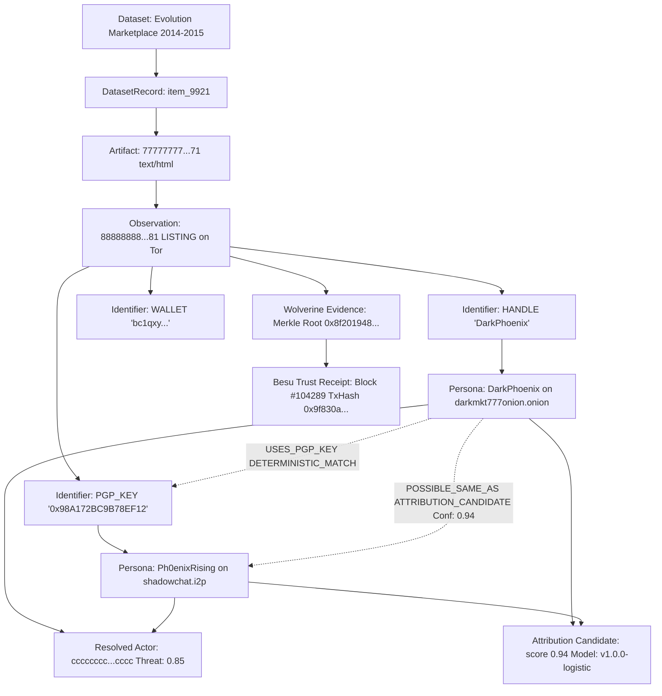

# Wolverine Intelligence — Phase 1 Database Implementation Report

## Status: COMPLETE

- **Database Engine**: PostgreSQL 15-alpine (Container: `wolverine-postgres`, Port: 5432)
- **ORM / Client**: Prisma Client 5.22.0
- **TypeScript Runtime**: tsx 4.19.3 / Node.js v25.9.0
- **Repository**: `wolverine-intelligence-core`
- **GitHub Target**: `https://github.com/solankiharsh2837/wolverine-intelligence-core`
- **Migration**: `20260822154922_init` (26 Tables, 11 PostgreSQL Enums, 58 Indexes)
- **Deterministic Seed**: Verified with 2 Networks, 2 Portals, 4 Dataset Registry entries, and 1 complete Master Trace chain.
- **Automated Tests**: 9 test suites / 25 test cases passing (100% pass rate).

---

## 1. Relational Schema Summary

All 26 canonical models from `docs/DATA-MODEL.md` are implemented in PostgreSQL:

| Table Name | Role | Primary Key | Key Relations & Constraints |
|---|---|---|---|
| `networks` | Overlay/clearnet networks (Tor, I2P, ZeroNet, Freenet, Clearnet) | UUID | `name` UNIQUE |
| `portals` | Discovered service endpoints | UUID | FK `networkId` -> `networks(id)` CASCADE |
| `assets` | Infrastructure servers, domains, IPs | UUID | FK `portalId` -> `portals(id)` SET NULL |
| `actors` | Resolved threat entities | UUID | High/Medium/Low threat ratings |
| `personas` | Network-specific identities | UUID | FK `actorId` -> `actors(id)`, FK `portalId` -> `portals(id)` |
| `accounts` | Portal registrations | UUID | UNIQUE(`portalId`, `accountId`) |
| `identifiers` | Unified typed identifiers (HANDLE, PGP_KEY, WALLET, EMAIL, etc.) | UUID | FK `networkId` -> `networks(id)` |
| `artifacts` | Raw collected payloads | UUID | `hash` UNIQUE (SHA-256) |
| `observations` | Canonical normalized intelligence statements | UUID | `canonicalPayloadHash` UNIQUE, FK `artifactId`, FK `datasetId` |
| `relationships` | Multi-class graph edges | UUID | 21 Types, 5 Classes, 5 Status lifecycle states |
| `relationship_evidence` | Evidentiary citations supporting graph edges | UUID | FK `relationshipId` -> `relationships(id)` CASCADE |
| `infrastructure_indicators` | Discovered technical fingerprints | UUID | FK `assetId` -> `assets(id)` CASCADE |
| `scans` | Scanner execution telemetry | UUID | FK `portalId` -> `portals(id)` |
| `findings` | Scanner detections & exposures | UUID | FK `scanId` -> `scans(id)` CASCADE |
| `attribution_candidates` | Scored persona-to-persona candidate links | UUID | Model versioning, 10-dimensional feature vector |
| `attribution_evidences` | Evidence items supporting candidate links | UUID | FK `candidateId` -> `attribution_candidates(id)` CASCADE |
| `attribution_features` | 10 normalized features $x_i \in [0,1]$ | UUID | FK `candidateId` -> `attribution_candidates(id)` CASCADE |
| `behavior_profiles` | Temporal, posting, and operational habits | UUID | FK `personaId` -> `personas(id)` CASCADE |
| `stylometric_profiles` | Lexical, punctuation, and structural stats | UUID | FK `personaId` -> `personas(id)` CASCADE |
| `timeline_events` | Chronological activity markers | UUID | Index on `(entityId, eventTime)` |
| `datasets` | Official dataset metadata registry | UUID | `name` UNIQUE, 6 explicit `DatasetUsage` designations |
| `dataset_records` | Dataset-to-canonical record mappings | UUID | FK `datasetId` -> `datasets(id)` CASCADE |
| `model_versions` | ML model registry | UUID | UNIQUE(`modelName`, `versionTag`) |
| `ai_hypotheses` | Advisory reasoning narratives | UUID | FK `modelId` -> `model_versions(id)`, status workflow |
| `wolverine_evidence` | Cryptographic evidence layer records | UUID | FK `observationId` -> `observations(id)` CASCADE |
| `trust_receipts` | Hyperledger Besu on-chain trust receipts | UUID | `transactionId` UNIQUE, FK `evidenceId` |

---

## 2. Dataset Registry (Phase 1 Baseline)

| Dataset Name | Usage Designation | Record Count | Integrity Hash | Source Reference |
|---|---|---|---|---|
| **Evolution Marketplace (2014-2015)** | `FEATURE_ENGINEERING` | 145,000 | `sha256-d7a8fbb...` | https://gwern.net/dnb-evolution |
| **Darknet Surfing Dataset** | `SYNTHETIC_CALIBRATION` | 82,000 | `sha256-4c919d3...` | https://darknetsurfing.org/archive |
| **NICT Darknet Dataset 2022** | `REFERENCE_ONLY` | 5,000,000 | `sha256-8a391c4...` | https://www.nict.go.jp/en/cyber/darknet/ |
| **VeriDark Authorship Dataset** | `TRAINING` | 65,000 | `sha256-e3b0c44...` | https://veridark.nlp.corpus/v1 |

---

## 3. Master Trace Example (DarkPhoenix -> Ph0enixRising)

The deterministic fixture provides an end-to-end verifiable attribution trace:



---

## 4. Test Suite Execution Results

Command: `npm run db:test` (using Node.js native test runner via tsx with isolated concurrency)

```
✔ Database Backup & Restore Smoke Test (2380ms)
✔ Dataset Registry Integrity (281ms)
  ✔ All 4 standard datasets are registered with distinct usages
  ✔ Datasets enforce unique names and valid SHA-256 hashes
✔ Enum Fidelity & Specification Compliance (8ms)
  ✔ RelationshipType contains all 21 specification types
  ✔ RelationshipStatus adheres to exact lifecycle
  ✔ EvidenceClass contains all 5 evidence classes
  ✔ DatasetUsage contains all 6 usage designations
✔ Foreign Key Integrity & Cascades (55ms)
  ✔ Cascade deletion of Network cascades to Portal and Persona
  ✔ Invalid Foreign Key reference is rejected by PostgreSQL
✔ Master Trace Traversal: Dataset -> Record -> Artifact -> Observation -> Identifier -> Persona -> Actor -> Relationship -> Candidate (281ms)
✔ Provenance Metadata Completeness (298ms)
  ✔ Every observation retains full immutable provenance fields
  ✔ Every identifier retains networkId, firstSeen, lastSeen, and source
✔ Schema Validation: All 26 canonical tables exist and respond to queries (29ms)
✔ Deterministic Development Seed Idempotency & Reproducibility (429ms)
✔ Unique Constraints Enforcement (57ms)
  ✔ Duplicate Network Name is rejected
  ✔ Duplicate Artifact Hash is rejected

Total: 25 tests passed, 0 failed.
```

---

## 5. Operability Commands

- **Start Database**: `npm run db:up`
- **Stop Database**: `npm run db:down`
- **Run Migrations**: `npm run db:migrate`
- **Generate Client**: `npm run db:generate`
- **Seed Fixture**: `npm run db:seed`
- **Inspect DB Records**: `npm run db:inspect`
- **Open Web GUI**: `npm run db:studio`
- **Backup Database**: `npm run db:backup`
- **Restore Database**: `npm run db:restore`
- **Execute Tests**: `npm run db:test`
