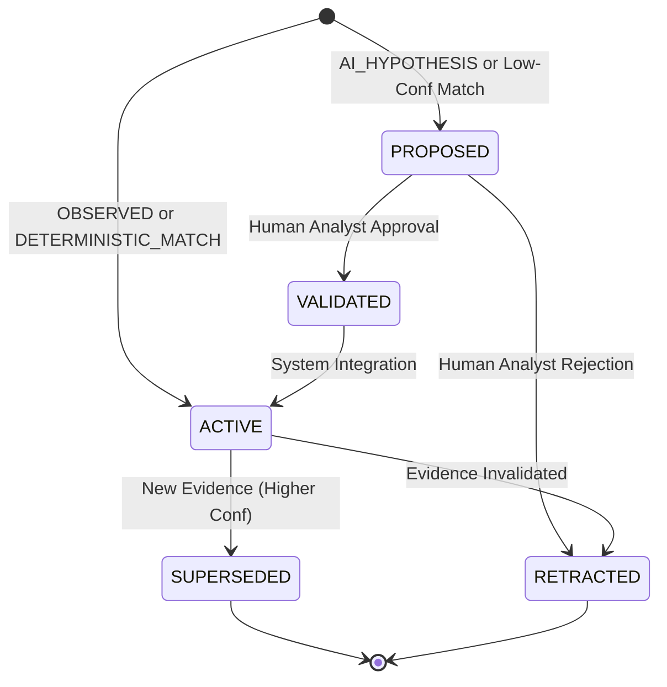
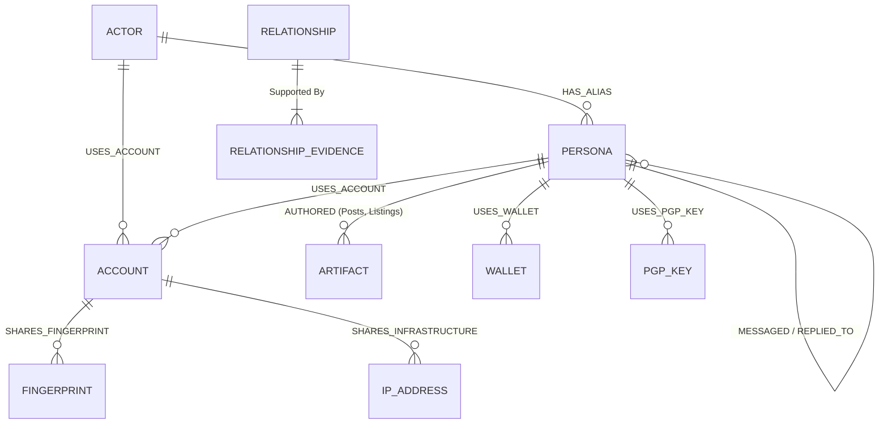

# Wolverine Intelligence: Relationship Taxonomy and Evidence Model

> [!IMPORTANT]
> **Core Axiom**: Relationships are the fundamental analytical output of Wolverine Intelligence. A relationship without provenance is indistinguishable from a hallucination. **AI is NEVER the hidden source of truth.** Every edge in the graph MUST cite its exact evidence.

## 1. Relationship Philosophy
The Wolverine Intelligence platform models threat actors, personas, and artifacts as a massive heterogeneous graph. The edges of this graph are "Relationships." 
- Every relationship MUST have an explicit `class` indicating how it was established.
- Classes are strictly segregated: `OBSERVED` ≠ `STATISTICAL_MATCH` ≠ `AI_HYPOTHESIS`.
- Every relationship must cite its source evidence in the `RelationshipEvidence` table.

## 2. Relationship Classes

| Class | Meaning | Example | Attribution Material? |
|---|---|---|---|
| `OBSERVED` | Directly witnessed in source data with no inference. | "@alice replied to @bob" in raw forum HTML. | Yes, as irrefutable ground truth (if source is authentic). |
| `DETERMINISTIC_MATCH` | Exact identifier reuse across contexts. | The exact same PGP key published on two different darknet markets. | Yes, high-confidence evidence. |
| `STATISTICAL_MATCH` | Feature-based probabilistic link exceeding threshold. | Stylometric similarity cosine $cos(\theta) > 0.92$. | Yes, requires calibrated confidence intervals. |
| `AI_HYPOTHESIS` | Generated by an LLM/AI model via reasoning. | "LLM read Chat Log A and Chat Log B and infers Persona 1 is Persona 2." | **No.** Advisory only. Requires human review. |
| `ATTRIBUTION_CANDIDATE` | Composite scoring generated by the fusion engine. | Combined score of Stylometry + Behavioral Time-of-Day match. | Yes, provided full feature vector breakdown is available. |
| `CRYPTOGRAPHIC_PROOF` | Mathematically proven and anchored on-chain. | Wolverine-attested, Besu-anchored digital signature verification. | Yes, highest confidence. |

## 3. Relationship Types

> [!NOTE]
> Below are the core relationship types supported by the system. Every type enforces specific source/target constraints and evidence requirements.

| Type Name | Source Entity | Target Entity | Required Evidence | Applicable Classes | Temporal? |
|---|---|---|---|---|---|
| `AUTHORED` | Persona | Artifact | Provenance record (e.g., HTML scrape showing authorship) | `OBSERVED` | Yes |
| `POSTED` | Persona | Artifact (Post) | Forum scrape data | `OBSERVED` | Yes |
| `REPLIED_TO` | Persona | Persona / Post | Thread hierarchy data | `OBSERVED` | Yes |
| `MESSAGED` | Persona | Persona | Intercepted/Leaked comms | `OBSERVED` | Yes |
| `LISTED` | Persona | Artifact (Listing) | Marketplace scrape | `OBSERVED` | Yes |
| `BOUGHT_FROM` | Persona (Buyer) | Persona (Seller) | Transaction ledger / Feedback | `OBSERVED`, `INFERRED` | Yes |
| `SOLD_TO` | Persona (Seller) | Persona (Buyer) | Transaction ledger / Feedback | `OBSERVED`, `INFERRED` | Yes |
| `REPUTATION_FOR` | Persona | Persona | Forum trust ratings / Vouches | `OBSERVED` | Yes |
| `VOUCHED_FOR` | Persona | Persona | Cryptographic or textual vouch | `OBSERVED`, `CRYPTOGRAPHIC_PROOF` | Yes |
| `USES_ACCOUNT` | Actor | Account | Login logs, deterministic leak | `DETERMINISTIC_MATCH`, `OBSERVED` | Yes |
| `HAS_ALIAS` | Actor | Persona | Overlapping identifiers | `DETERMINISTIC_MATCH`, `AI_HYPOTHESIS` | Yes |
| `USES_WALLET` | Persona | WalletAddress | Transaction scraping | `OBSERVED`, `STATISTICAL_MATCH` | Yes |
| `USES_PGP_KEY` | Persona | PGPKey | Profile scraping | `OBSERVED`, `CRYPTOGRAPHIC_PROOF` | Yes |
| `POSSIBLE_SAME_AS` | Persona | Persona | High stylometric/behavioral similarity | `STATISTICAL_MATCH`, `AI_HYPOTHESIS`, `ATTRIBUTION_CANDIDATE` | No |
| `MIGRATED_TO` | Persona | Persona | Temporal correlation of account death/birth | `STATISTICAL_MATCH`, `ATTRIBUTION_CANDIDATE` | Yes |
| `SHARES_INFRASTRUCTURE`| Persona | IP / Domain | Netflow, DNS, Server logs | `DETERMINISTIC_MATCH`, `OBSERVED` | Yes |
| `SHARES_FINGERPRINT` | Account | BrowserFingerprint| Client-side tracking data | `DETERMINISTIC_MATCH` | Yes |
| `SHARES_COUNTERPARTY` | Persona | Persona | Graph overlap computation | `STATISTICAL_MATCH` | Yes |
| `TEMPORALLY_CORRELATED`| Persona | Persona | Behavioral time-series analysis | `STATISTICAL_MATCH` | Yes |
| `INSTRUMENTED_BY` | Actor | MalwareFamily | C2 attribution, source code analysis | `STATISTICAL_MATCH`, `ATTRIBUTION_CANDIDATE` | Yes |

## 4. Relationship Status Lifecycle

All relationships, regardless of origin, follow this state machine:

- **PROPOSED**: Requires human review.
- **VALIDATED**: Analyst verified, pending system propagation.
- **ACTIVE**: In use for downstream graphs and querying.
- **SUPERSEDED**: A stronger piece of evidence updated the relationship properties.
- **RETRACTED**: The underlying evidence was proven false or manipulated.

## 5. Evidence Requirements

Every relationship must map to 1-to-N records in `RelationshipEvidence`.

### Schema: RelationshipEvidence
| Field | Type | Required | Description |
|---|---|---|---|
| `id` | UUID | Yes | Unique identifier for the evidence block |
| `relationshipId` | UUID | Yes | FK to the Relationship |
| `evidenceClass` | Enum | Yes | `OBSERVED`, `STATISTICAL_MATCH`, etc. |
| `sourceId` | UUID | Yes | ID of the origin data (e.g., RawScrape, MLModelRun) |
| `confidence` | Float | Yes | $[0.0, 1.0]$. 1.0 for `OBSERVED` and `DETERMINISTIC` |
| `featureVector` | JSONB | No | Full array of features if `STATISTICAL_MATCH` |
| `version` | String | Yes | Version of the model or adapter that generated it |

> [!CAUTION]
> If a source artifact is deleted or marked as poisoned, all cascading `RelationshipEvidence` must be automatically `RETRACTED`.

## 6. Graph Model

## 7. Human Operability

**HOW TO INSPECT A RELATIONSHIP:**
Analysts can view the exact evidence trail via the CLI:
`agy graph inspect-edge <relationship-id>`
This will output the `RelationshipEvidence` JSON, including the raw `featureVector` and the associated `model_version`.

For related statistical modeling, see [STYLOMETRY.md](STYLOMETRY.md) and [BEHAVIOR-MODEL.md](BEHAVIOR-MODEL.md).
