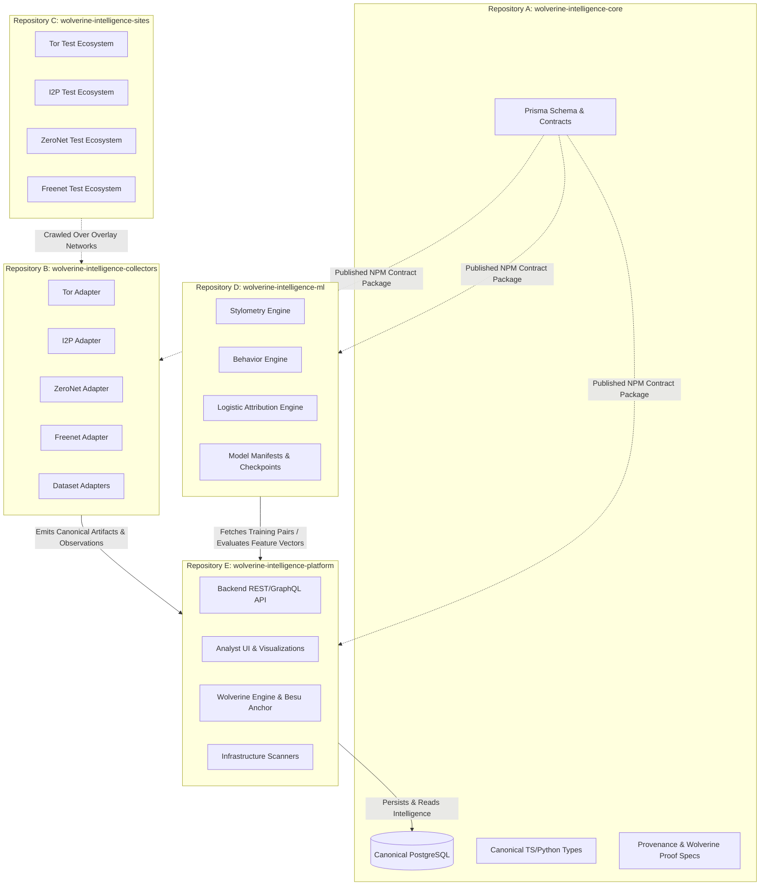

# Wolverine Intelligence — Repository Architecture & Module Boundaries

## 1. Executive Summary

To balance modularity, team velocity, security isolation, and deployment scalability without recreating the repository fragmentation of previous hackathons, **Wolverine Intelligence** adopts an intentional **5-Repository Architecture**.

This architecture guarantees:
- **Clean Separation of Concerns**: Core contracts, data collection, test environments, machine learning pipelines, and operational platform interfaces remain logically and physically decoupled.
- **Single Source of Truth**: The intelligence database belongs strictly to the **Core** foundation. Repositories communicate through strict data contracts, API interfaces, and canonical schema definitions rather than maintaining fragmented database mirrors.
- **Portability & Independent Scaling**: Heavy ML workloads and network-specific crawlers scale independently on heterogeneous infrastructure (e.g., GPU clusters for stylometry/LLMs, distributed nodes for Tor/I2P adapters).

---

## 2. Target Repository Registry

| Repository Name | Purpose | Ownership & Contents | Runtime | Deployment Unit | Scaling Model |
|---|---|---|---|---|---|
| **`wolverine-intelligence-core`** *(Active in Phase 1)* | Shared contracts, canonical types, and database foundation | Prisma schema, SQL migrations, canonical interfaces, database seed, inspection & backup tools | Node.js 20+, TypeScript, PostgreSQL 15 | Database & Published NPM/PyPI contracts | Centralized Single-Instance / Replicated DB |
| **`wolverine-intelligence-collectors`** | Network collection & dataset ingestion | `collection/core`, `collection/tor`, `collection/i2p`, `collection/zeronet`, `collection/freenet`, `collection/clearnet`, `collection/datasets` | Node.js / Go / Python | Distributed Worker Containers / Daemons | Horizontal Worker Pool per network |
| **`wolverine-intelligence-sites`** | Independent synthetic test ecosystems | `sites/tor`, `sites/i2p`, `sites/zeronet`, `sites/freenet` (Marketplaces, Forums, Messaging, Escrow) | Node.js / Python / Static Daemons | Isolated Docker Network / Simulation Pods | On-demand staging/test deployment |
| **`wolverine-intelligence-ml`** | Stylometry, behavior, and attribution models | `ml/stylometry`, `ml/behavior`, `ml/attribution`, `ml/infrastructure`, `models/manifests`, `models/checkpoints` | Python 3.11+, PyTorch, Scikit-Learn | GPU/CPU Batch Inference & Training Tasks | Task-based autoscaling |
| **`wolverine-intelligence-platform`** | Operational user-facing platform | `backend/api`, `frontend/ui`, `scanners/`, `wolverine/` trust service | Node.js, React, Besu Client | Web Service + API Pods | Horizontal API Gateway & Service Pods |

---

## 3. Database Ownership & Relational Law

> [!IMPORTANT]
> **Database Ownership Law**: The canonical intelligence database belongs **exclusively** to `wolverine-intelligence-core`.
>
> - Other repositories **MUST NOT** spin up competing production database schemas or define divergent entity models.
> - `wolverine-intelligence-core` publishes the authoritative schema and TypeScript/Python types.
> - Downstream consumers interact with intelligence data through the Platform API or via the published Prisma client library.

---

## 4. Cross-Repository Data Flow & Communication Contracts

### 4.1 Ingestion Flow (Collectors -> Platform -> Core DB)
1. Collectors fetch raw bytes from overlay networks or datasets.
2. Collectors normalize raw payloads into the **Canonical Observation** structure defined by `@wolverine/core-types`.
3. Ingestion occurs via the Platform Ingestion API endpoint `POST /api/v1/collection/ingest`, which validates schema compliance and commits the transaction to the Core Database.

### 4.2 Analytical & ML Flow (Core DB -> Platform -> ML -> Core DB)
1. The ML subsystem reads historical training datasets or persona feature matrices via `GET /api/v1/attribution/features`.
2. Feature vectors x in [0,1]^10 are evaluated using calibrated logistic models.
3. Inferred relationships and attribution candidates are written back via `POST /api/v1/attribution/candidates` with explicit `STATISTICAL_MATCH` or `ATTRIBUTION_CANDIDATE` evidence classifications.

### 4.3 Trust & Verification Flow (Core DB -> Platform -> Wolverine -> Besu)
1. Batches of canonical observations are ingested.
2. Wolverine compiles canonical byte hashes into a binary Merkle tree (R_w).
3. The Merkle root and attestation signature are committed to the Hyperledger Besu smart contract.
4. An immutable `TrustReceipt` is stored in the Core Database.

---

## 5. Repository Evolution & Phase 1 Execution Strategy

To prevent empty repository sprawl:
1. **Phase 1 implements `wolverine-intelligence-core`** containing the database infrastructure, Prisma schema, deterministic seed, dataset registry, test suites, and inspection tools.
2. Future repositories (`collectors`, `sites`, `ml`, `platform`) will be initialized during their respective implementation phases when their foundational code is ready.
3. The root repository maintains directory scaffolds and specification references to ensure developer inspectability at every stage.
