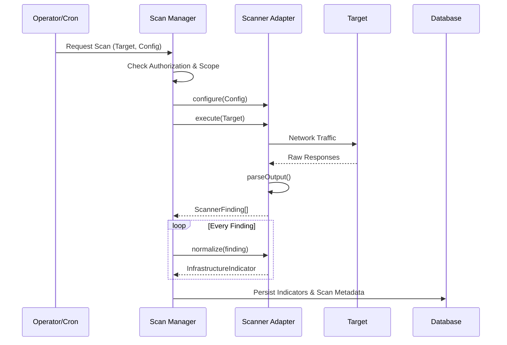

# Wolverine Intelligence: Scanner Architecture

> [!IMPORTANT]
> **SYSTEM BOUNDARY RULE**: Network adapters must respect each network's native semantics. Scanners cannot force Tor hidden services or proprietary P2P protocols into standard HTTP parsers without explicit protocol bridging.

This document specifies the scanner integration architecture. It defines how external scanning utilities (like Nmap or Nuclei) are wrapped, executed, and normalized into the Wolverine Intelligence platform.

See also: [INFRASTRUCTURE-INTELLIGENCE.md](INFRASTRUCTURE-INTELLIGENCE.md).

---

## 1. Scanner Adapter Interface

All scanner integrations MUST implement the standard `ScannerAdapter` interface to ensure unified execution, rate limiting, and output parsing.

```typescript
interface ScannerAdapter {
  scannerId: string;
  scannerVersion: string;
  configure(config: ScanConfig): void;
  execute(target: ScanTarget): ScanResult;
  parseOutput(raw: any): ScannerFinding[];
  normalize(finding: ScannerFinding): InfrastructureIndicator | ExposureFinding | VulnerabilityFinding;
  getRateLimits(): RateLimitConfig;
  getAuthorizationRequirements(): AuthorizationSpec;
}
```

*   `scannerVersion`: Strict tracking of the underlying tool version.
*   `getRateLimits()`: Defines the maximum concurrent executions and delay between requests to avoid operational burnout.
*   `getAuthorizationRequirements()`: Checks if the scanner requires explicit legal/operational authorization before running (e.g., active exploitation vs. passive DNS).

---

## 2. Per-Scanner Specifications

### 2.1 httpx
*   **Description**: Fast and multi-purpose HTTP toolkit.
*   **Input (Targets)**: IP addresses, Clearnet Domains, Onion URLs.
*   **Output (Findings)**: Status codes, content length, server headers, tech detection (Wappalyzer), title.
*   **Tool Version Tracking**: `httpx` binary version (e.g., v1.3.5).
*   **Evidence Quality**: `OBSERVED` (High reliability).
*   **Scope Limitations**: Only supports HTTP/HTTPS over TCP (or Tor proxies).
*   **Rate Limits**: Configurable up to 50 req/s.
*   **Authorization**: None (Passive web probing is generally safe).

### 2.2 Nuclei
*   **Description**: Template-based fast vulnerability scanner.
*   **Input (Targets)**: Web endpoints.
*   **Output (Findings)**: CVE matches, misconfigurations, exposed panels.
*   **Tool Version Tracking**: Binary version AND Nuclei-Templates repository hash.
*   **Evidence Quality**: `OBSERVED` (Varies by template confidence).
*   **Scope Limitations**: Heavily dependent on template recency.
*   **Rate Limits**: Max 10 req/s per target.
*   **Authorization**: **REQUIRED**. Running intrusive templates requires `ACTIVE_EXPLOIT` authorization level.

### 2.3 Nmap
*   **Description**: Network exploration and security auditing.
*   **Input (Targets)**: IP addresses, subnets.
*   **Output (Findings)**: Open ports, service banners, OS fingerprints.
*   **Tool Version Tracking**: `nmap` binary version.
*   **Evidence Quality**: `OBSERVED` (High reliability).
*   **Scope Limitations**: High network noise; easily blocked by IDSs.
*   **Rate Limits**: T2 (Polite) timing template enforced by default.
*   **Authorization**: **REQUIRED**. Active port scanning must be authorized.

### 2.4 TLS Fingerprinting (JA3/JA4/JARM)
*   **Description**: Extracts cryptographic signatures from TLS handshakes.
*   **Input (Targets)**: IPs/Domains serving TLS.
*   **Output (Findings)**: JA3/JA4 client hashes, JARM server hashes, raw certificate chains.
*   **Tool Version Tracking**: Internal JARM library version.
*   **Evidence Quality**: `CRYPTOGRAPHIC_IDENTIFIER` (Extremely high).
*   **Scope Limitations**: Requires successful TLS negotiation.
*   **Rate Limits**: N/A (single connection per target).
*   **Authorization**: None.

### 2.5 Passive DNS / Intelligence
*   **Description**: Queries external threat intel APIs (e.g., VirusTotal, Shodan, SecurityTrails).
*   **Input (Targets)**: Domains, IPs, Hashes.
*   **Output (Findings)**: Historical A records, WHOIS data, tag associations.
*   **Tool Version Tracking**: API version endpoint.
*   **Evidence Quality**: `THIRD_PARTY_REFERENCE` (Subject to external provider reliability).
*   **Scope Limitations**: Cannot scan internal/dark networks directly.
*   **Rate Limits**: Dictated by API quota limits.
*   **Authorization**: None (OSINT).

---

## 3. Finding Normalization

The process of taking `ScannerFinding` and turning it into normalized data:

1.  **InfrastructureIndicator**: Produced when a scanner finds a structural identifier (e.g., `httpx` finds an identical Favicon hash).
2.  **ExposureFinding**: Produced when a scanner finds sensitive data leakage (e.g., an `.env` file exposed).
3.  **VulnerabilityFinding**: Produced by `Nuclei` matching a CVE template.
4.  **Observation**: General fallback for findings that do not map to the above (e.g., generic port 80 open).

---

## 4. Scan Management

Scans are managed asynchronously.

*   **Scheduling**: Cron-based or trigger-based (e.g., new domain discovered $\rightarrow$ trigger `httpx` scan).
*   **Scoping**: Enforced via `ScopeEngine`. A target must belong to an approved workspace boundary. Scanning out-of-scope targets automatically rejects the job.
*   **Result Storage**: Stored in PostgreSQL, with raw JSON payloads archived in blob storage (S3-compatible) to preserve exact provenance.
*   **Scan Versioning**: Every scan records the exact timestamp, scanner ID, scanner version, and target state.



---

## 5. Operability

*   **HOW TO RUN A SCAN**: `agy scan execute --scanner nuclei --target <ip>`
*   **HOW TO ADD A SCANNER**: Implement the `ScannerAdapter` class in `src/scanners/adapters/` and register it in `ScannerRegistry.ts`. Update this document.
*   **HOW TO INSPECT RESULTS**: `agy scan results --id <scan_id>` to view findings and generated indicators.
*   **HOW TO VALIDATE FINDINGS**: Use the UI or `agy trace finding <finding_id>` to view the raw network payload that generated the finding, ensuring verifiable provenance.
