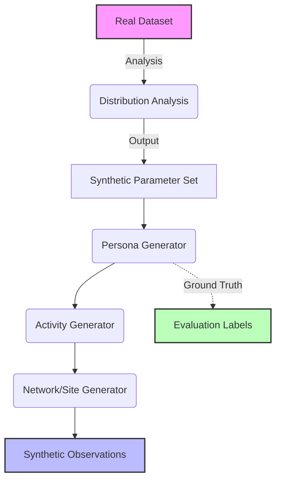

# Wolverine Intelligence: Synthetic Data Generation Specification

## 1. Synthetic Generation Philosophy

The Wolverine Intelligence platform utilizes synthetic data generation as a cornerstone for development, testing, and demonstration without compromising operational security or handling sensitive intelligence unnecessarily. 

- **Supplementation:** Synthetic data supplements real data; it does not replace the need for real-world validation but provides a safe baseline.
- **Calibration:** All synthetic data must be statistically calibrated against real dataset distributions to ensure realism.
- **Strict Separation:** Synthetic data must be explicitly and permanently marked as synthetic. Under no circumstances should synthetic data contaminate real intelligence stores.
- **Reproducibility:** Every synthetic dataset must be fully reproducible from a defined seed and configuration version.
- **Multi-Network Realism:** The system must generate realistic activity patterns spanning multiple distinct networks (e.g., Tor, I2P, Telegram).

> [!CAUTION]
> AI is NEVER the hidden source of truth in Wolverine Intelligence. The synthetic generator creates ground-truth graphs explicitly, and AI models are evaluated against these deterministic facts.

## 2. Generation Pipeline

The generation pipeline ensures that real-world observations inform the synthetic parameters, which then drive the generation of personas, activities, and network events.



## 3. Distribution Analysis (`synthetic/calibration/`)

To achieve realism, the system analyzes real datasets to extract underlying statistical distributions.

### Extracted Distributions
- **Posting Frequency:** Temporal spacing of posts per actor.
- **Time-of-day/Day-of-week:** Circadian and weekly rhythms of activity.
- **Vocabulary:** Word frequency and n-gram distributions.
- **Listing Price:** Distribution of prices across different product categories.
- **Transaction Volume:** Frequency and size of transactions.
- **Review Length:** Character and word counts for product reviews.
- **Identity Reuse:** Rate at which identifiers (e.g., PGP keys, handles) are reused across accounts.
- **Cross-site Migration Rates:** Frequency of actors moving from defunct to active platforms.
- **Forum Participation:** Thread creation vs. reply ratios.

### Output
The output is a set of distribution parameter files tagged with:
- `datasetVersion`: The specific version of the real dataset analyzed.
- `analysisVersion`: The version of the analysis algorithm used.

## 4. Persona Generator (`synthetic/personas/`)

The Persona Generator creates the core actors in the synthetic universe. Each actor may have multiple personas across different networks, exhibiting varying degrees of identity reuse and behavioral consistency.

### Features
- **Multi-Persona Actors:** One physical "Actor" controlling multiple online "Personas".
- **Identity Reuse Patterns:** Controlled deterministic matching (e.g., sharing a PGP key) vs. disjoint identities.
- **Writing Style Profiles:** Specific parameters for vocabulary usage, sentence length, and punctuation habits.
- **Behavioral Profiles:** Active hours, posting frequencies, and platform preferences.
- **Known Ground-Truth Links:** Retained deterministic links tying personas back to the parent actor.

### Configuration Schema

| Field | Type | Required | Description | Constraints |
|---|---|---|---|---|
| `actorId` | `String` | Yes | Unique identifier for the synthetic actor | UUID format |
| `personas` | `SyntheticPersona[]` | Yes | List of personas controlled by this actor | Minimum 1 persona |
| `writingStyle` | `WritingStyleConfig` | Yes | Statistical parameters for text generation | Defined calibration limits |
| `behaviorProfile` | `BehaviorConfig` | Yes | Parameters for temporal and interaction behavior | Must map to circadian cycles |
| `migrationPlan` | `MigrationConfig[]` | No | Planned movements between sites/networks | Sequential timestamps |
| `seed` | `Number` | Yes | Random seed for exact reproducibility | Unsigned 32-bit integer |

## 5. Activity Generator (`synthetic/activity/`)

The Activity Generator simulates the actions taken by synthetic personas over time.

### Generated Streams
- **Forum Posts:** Generated using the persona's `WritingStyleConfig`.
- **Marketplace Listings:** Realistic product descriptions, prices, and categories.
- **Transactions & Reviews:** Buyers purchasing listings and leaving feedback.
- **PGP Key Usage:** Signatures and encrypted message metadata.
- **Wallet Transactions:** Cryptocurrency flows between vendor, buyer, and escrow wallets.
- **Cross-site Migrations:** Coordinated shutdown on one site and appearance on another.
- **Infrastructure Setup:** Domain registration, hosting procurement.

### Temporal Realism
Activity generation strictly adheres to the persona's `BehaviorConfig`. Gaps, bursts, weekend/weekday patterns, and migration timing are generated using mathematical distributions (e.g., Poisson processes for bursty traffic) calibrated from real data.

## 6. Population Generator (`synthetic/population/`)

This module orchestrates the generation of an entire ecosystem.

### Population Parameters
- **$N$ Actors:** Total number of root synthetic actors.
- **$M$ Personas/Actor:** Average personas per actor (distribution).
- **$K\%$ Cross-Network:** Percentage of actors operating on $>1$ network.
- **$J\%$ Migration Rate:** Percentage of actors that rebrand or migrate during the simulation.
- **Community Structure:** Small-world network topology generation, not random graphs.
- **Marketplace Dynamics:** Simulates a functioning economy with vendors, buyers, listings, and transactions.
- **Forum Dynamics:** Simulates organic thread creation, replies, and reputation scoring.

## 7. Network/Site Generator

Wolverine Intelligence relies on distinct network adapters respecting native semantics. The Network/Site Generator maps generated activity onto simulated environments.

- **`sites/tor/marketplace/`**: Populated with synthetic HTTP marketplace endpoints and listings.
- **`sites/tor/forum/`**: Populated with synthetic forum threads and posts.
- **`sites/i2p/`**: Populated with a subset of the population interacting on I2P services.

> [!IMPORTANT]
> Sites are independent implementations. They are NOT a single application masquerading as multiple networks. A Tor marketplace adapter expects Tor hidden service semantics, while a Telegram adapter expects Telegram API semantics.

## 8. Provenance Model (CRITICAL)

To maintain the integrity of Wolverine Intelligence, every piece of synthetic data must carry its provenance.

| Field | Type | Required | Description | Constraints |
|---|---|---|---|---|
| `distributionSource` | `String` | Yes | Identifier of the real dataset used for calibration | Must exist in calibration registry |
| `datasetVersion` | `String` | Yes | Version of the real dataset | Semantic versioning |
| `generatorVersion` | `String` | Yes | Version of the generator code used | Git commit hash / SemVer |
| `seed` | `Number` | Yes | Random seed used for generation | Unsigned 32-bit integer |
| `syntheticActorId` | `String` | Yes | Link to the root actor definition | Must exist in synthetic graph |
| `syntheticPersonaId` | `String` | Yes | Link to the specific persona | Must exist in synthetic graph |
| `isSynthetic` | `Boolean` | Yes | Explicit flag marking data as synthetic | **ALWAYS TRUE** |
| `generatedAt` | `Timestamp` | Yes | Time the record was created by the generator | ISO 8601 |

## 9. Ground Truth Labels

The synthetic generation process emits a secondary "Ground Truth" dataset, explicitly inaccessible to the primary analysis pipelines.

### Contents
- Exact mapping of Personas to Actors.
- Precise timestamps of migrations.
- Shared deterministic identifiers.
- Exact writing style parameters used.

### Usage
- **AI Hypothesis Evaluation:** Training and evaluating AI models for STATISTICAL_MATCH and AI_HYPOTHESIS generation.
- **Feature Engineering Validation:** Confirming that new analytical features correctly separate distinct actors.
- **System Integration Testing:** Providing end-to-end deterministic test cases for the attribution engine.

## 10. Calibration Validation

Calibration validation ensures the synthetic data mathematically resembles the real dataset.

- **Statistical Tests:** Uses Kolmogorov-Smirnov (KS) tests for continuous distributions (e.g., timing) and Chi-squared tests for categorical distributions (e.g., vocabulary).
- **Visual Comparison:** Generates histograms and Q-Q plots.
- **Calibration Report:** Output report detailing `distributionSource`, synthetic parameters, and passing/failing test results for each modeled feature.

$$ D_{KS} = \sup_x | F_{real}(x) - F_{synthetic}(x) | $$

## 11. Versioning

Every aspect of the synthetic pipeline is rigorously versioned:
- `generatorVersion`: Codebase version (Git SHA).
- `calibrationVersion`: The specific set of distribution parameters.
- `populationVersion`: The final generated dataset.

Any `populationVersion` must be perfectly reproducible given `generatorVersion` + `calibrationVersion` + `seed`.

## 12. Operability

### HOW TO generate a synthetic population
```bash
wolverine-synth generate --population-config=config/pop_large.yaml --seed=42 --output=data/synth_v1/
```

### HOW TO calibrate against a real dataset
```bash
wolverine-synth calibrate --input=data/real/dataset_v3/ --output=config/calibrations/cal_v3.yaml
```

### HOW TO verify calibration quality
```bash
wolverine-synth validate --real=data/real/dataset_v3/ --synthetic=data/synth_v1/ --report=reports/cal_report.md
```

### HOW TO load synthetic data into test sites
```bash
wolverine-synth load --synthetic-dir=data/synth_v1/ --target-env=local-dev
```

### HOW TO reset synthetic data
```bash
wolverine-synth purge-synthetic --target-env=local-dev --confirm
```

### HOW TO reproduce a specific generation run
Obtain the `generatorVersion`, `calibrationVersion`, and `seed` from the target record's provenance metadata, checkout the correct `generatorVersion`, and re-run the `generate` command with those specific inputs.
