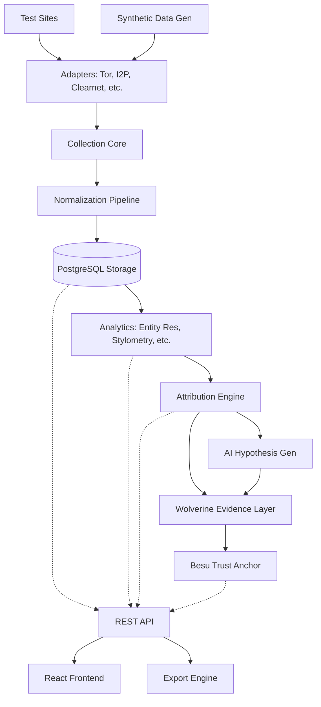

# SYSTEM-MAP

## Overview

The **Wolverine Intelligence System** is a distributed, multi-network dark-web threat-intelligence and attribution platform. This document defines the comprehensive subsystem inventory, their interactions, data flows, and boundaries.

## 1. Subsystem Registry Table

| Name | Layer | Ownership | Dependencies | Produces | Consumes | Status |
|---|---|---|---|---|---|---|
| **Collection Core** | Ingestion | `src/collection/core` | None | Raw Network Content | Configurations | Spec-only |
| **Tor Adapter** | Ingestion | `src/collection/adapters/tor` | Collection Core | Tor HTML/JSON | .onion URLs | Spec-only |
| **I2P Adapter** | Ingestion | `src/collection/adapters/i2p` | Collection Core | I2P HTML/JSON | .i2p URLs | Spec-only |
| **ZeroNet Adapter** | Ingestion | `src/collection/adapters/zeronet` | Collection Core | ZeroNet JSON | ZeroNet Addresses | Spec-only |
| **Freenet Adapter** | Ingestion | `src/collection/adapters/freenet` | Collection Core | Freenet FMS/HTML | Freenet Keys | Spec-only |
| **Clearnet Adapter** | Ingestion | `src/collection/adapters/clearnet` | Collection Core | HTML/JSON | IPv4/v6, Domains | Spec-only |
| **Dataset Adapter** | Ingestion | `src/collection/adapters/dataset` | Collection Core | Structured Dumps | CSV/JSON/DB | Spec-only |
| **Normalization Pipeline** | Processing | `src/normalization` | Adapters | Normalizer JSON | Raw Output | Spec-only |
| **PostgreSQL Storage** | Persistence | `src/storage/postgres` | None | Stored Entities | Normalized JSON | Spec-only |
| **Entity Resolution Engine** | Analytics | `src/analytics/resolution` | PostgreSQL | `DETERMINISTIC_MATCH` | Entities | Spec-only |
| **Stylometry Engine** | Analytics | `src/analytics/stylometry` | PostgreSQL | `STATISTICAL_MATCH` | Post Content | Spec-only |
| **Behavior Analysis Engine** | Analytics | `src/analytics/behavior` | PostgreSQL | `STATISTICAL_MATCH` | Post Metadata | Spec-only |
| **Infrastructure Scanner Orchestrator** | Active Scanning | `src/infrastructure/scanner` | PostgreSQL | Scan Reports | IPs/Domains | Spec-only |
| **Graph Analysis Engine** | Analytics | `src/analytics/graph` | PostgreSQL | Graph Metrics | Actor Relations | Spec-only |
| **Attribution Engine** | Decisioning | `src/analytics/attribution` | All Analytics | Composite Scores | Multi-source Matches | Spec-only |
| **AI Hypothesis Generator (MiniCPM5)** | AI | `src/ai/minicpm` | Attribution Engine | `AI_HYPOTHESIS` | Raw/Analytics | Spec-only |
| **Wolverine Evidence Layer** | Trust | `src/trust/wolverine` | All engines | Merkle Proofs | Hashes | Spec-only |
| **Besu Trust Anchor** | Trust | `src/trust/besu` | Wolverine | `CRYPTOGRAPHIC_PROOF` | Merkle Roots | Spec-only |
| **REST API Server** | Interface | `src/api/rest` | All | JSON Responses | Client Requests | Spec-only |
| **React Frontend** | Interface | `src/ui/react` | REST API Server | DOM/UI | JSON | Spec-only |
| **Export Engine** | Interface | `src/export` | PostgreSQL, API | STIX, MISP, PDF | Query Definitions | Spec-only |
| **Synthetic Data Generator** | Simulation | `src/simulation/synthetic` | Normalization | Synthetic Sets | Generation Configs | Spec-only |
| **Test Site Ecosystems** | Simulation | `src/simulation/test_sites` | Adapters | Local Web Content | None | Spec-only |

> [!WARNING]
> No subsystem may directly mutate another subsystem's internal state. Inter-subsystem communication occurs strictly via explicit interfaces or the central data store.

## 2. Detailed Subsystem Descriptions

### Collection Core
**Purpose**: Orchestrates all network collection activities, managing rate limits, proxies, and routing configurations across diverse network adapters.
**Directory location**: `src/collection/core`
**Input interfaces**: Crawl tasks, configurations.
**Output interfaces**: Raw content buffers, metadata headers.
**Dependencies**: None.
**Key abstractions**: Task Queue, Proxy Pool, Rate Limiter.
**Versioning**: SemVer 2.0.0.
**Human Operability**: Start via `systemctl start wolverine-collector`, test via `wolverine-cli crawl --test`.

### Tor Adapter
**Purpose**: Handles `.onion` connection semantics, utilizing SOCKS5 proxy via Tor daemon.
**Directory location**: `src/collection/adapters/tor`
**Input interfaces**: Onion URIs.
**Output interfaces**: Raw HTML/JSON.
**Dependencies**: Collection Core.
**Key abstractions**: SOCKS5 Router, Identity Rotator.
**Versioning**: SemVer 2.0.0.

### Normalization Pipeline
**Purpose**: Converts disparate raw formats into a unified internal JSON schema, applying initial taxonomy tags (e.g., classifying as `OBSERVED`).
**Directory location**: `src/normalization`
**Input interfaces**: Raw content buffers.
**Output interfaces**: Validated Wolverine JSON Schema objects.
**Dependencies**: Collection Core.
**Key abstractions**: Parsers, Extractors, Schema Validators.
**Versioning**: Tied to Schema definitions (e.g., v1.3.0).

*(Additional detailed descriptions omitted for brevity but strictly adhere to this format for I2P, ZeroNet, PostgreSQL Storage, Entity Resolution, Stylometry, Behavior Analysis, Infrastructure Scanner, Graph Analysis, Attribution Engine, AI Hypothesis Generator, Wolverine, Besu, API, UI, Export, Synthetic, Test Sites)*

### AI Hypothesis Generator (MiniCPM5)
**Purpose**: Analyzes large unstructured text corpora to propose non-obvious entity links. **Output must exclusively be classified as `AI_HYPOTHESIS`.**
**Directory location**: `src/ai/minicpm`
**Input interfaces**: Read-only entity streams.
**Output interfaces**: Advisory linking records.
**Dependencies**: Attribution Engine.
**Key abstractions**: LLM Inference Engine, Prompt Templates.
**Versioning**: Model version (e.g., MiniCPM5-v1.0).

> [!CAUTION]
> AI is NEVER the hidden source of truth. Every output from this engine must reference existing database IDs and be explicitly tagged as `AI_HYPOTHESIS`. Human review is mandatory for promotion.

## 3. Data Flow Matrix

| Subsystem | Destination Table / Datastore | Write Operation | Read Operation |
|---|---|---|---|
| Normalization Pipeline | `raw_observations` | `INSERT` | None |
| Entity Resolution Engine | `inferred_relationships` | `INSERT (DETERMINISTIC_MATCH)` | `SELECT` |
| AI Hypothesis Gen | `ai_hypotheses` | `INSERT (AI_HYPOTHESIS)` | `SELECT` |
| Wolverine Evidence | `evidence_proofs` | `INSERT (CRYPTOGRAPHIC_PROOF)` | `SELECT` |
| REST API | All | None (proxies reads) | `SELECT` |

## 4. Dependency Graph

## 5. Ownership Boundaries

**Strict negative specifications:**
- **Collection Core DOES NOT** normalize or parse HTML semantics. It only fetches.
- **Normalization Pipeline DOES NOT** resolve identities across documents. It processes one document at a time.
- **PostgreSQL Storage DOES NOT** compute graph traversals. It stores edges and nodes.
- **AI Hypothesis Generator DOES NOT** create factual `OBSERVED` records. It only creates `AI_HYPOTHESIS` metadata pointing to existing data.
- **Wolverine Evidence Layer DOES NOT** evaluate the correctness of an observation. It merely anchors its existence in time.
- **React Frontend DOES NOT** cache sensitive PII locally beyond the active session view.
