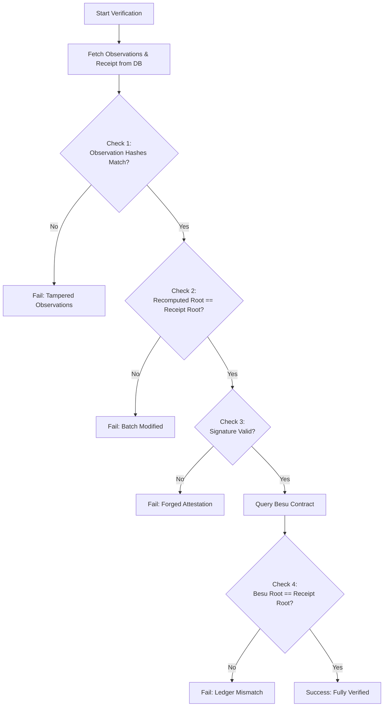

# Wolverine Intelligence: Tamper Verification Mathematics

## 1. Tamper Detection Model

The core of Wolverine's tamper detection relies on comparing computed states against anchored immutable states.

Let:
*   $R_w$ = Original witnessed Merkle root (stored immutably on the Besu ledger).
*   $R_c$ = Current recomputed Merkle root (computed dynamically from the current state of the PostgreSQL database).

**Integrity Condition:** 
$$R_c = R_w$$

**Tamper Condition:** 
$$R_c \neq R_w$$

## 2. Four Independent Integrity Checks

To precisely isolate tampering, the verification process is broken into four distinct mathematical checks.

### Check 1: Observation Integrity
Verifies that individual observations have not been modified since attestation.
*   **Action:** Recompute the hash of each observation from its canonical form in the database and compare it with the hash stored in the Trust Receipt's leaf array.
*   **Pass:** All computed hashes match the stored hashes.
*   **Fail:** A specific observation has been modified.
*   **Formula:** For each observation $i$:
    $$H(\text{canonical}(o_i)) = h_i^{\text{stored}}$$

### Check 2: Receipt Integrity
Verifies that the set of observations in a batch has not been altered (added, removed, or reordered).
*   **Action:** Recompute the Merkle root from the sequence of observation hashes found in the Trust Receipt. Compare it with the root stored in the receipt.
*   **Pass:** The recomputed root matches the receipt's root.
*   **Fail:** Observations have been added, removed, or reordered within the batch.
*   **Formula:**
    $$\text{MerkleRoot}(h_1, h_2, ..., h_n) = R_{\text{receipt}}$$

### Check 3: Trust Chain Integrity
Verifies that the attestation signature is valid and originated from the authentic Wolverine service key.
*   **Action:** Verify the ECDSA signature on the receipt's Merkle root using the known Wolverine public key.
*   **Pass:** Signature is mathematically valid.
*   **Fail:** The attestation has been forged, or the signing key has been compromised/changed.
*   **Formula:**
    $$\text{Verify}(\text{pubkey}, R_{\text{receipt}}, \sigma) = \text{true}$$

### Check 4: Current State Integrity (On-Chain)
Verifies that the Trust Receipt itself has not been fabricated and matches the global consensus state.
*   **Action:** Query the Besu smart contract for the stored root and compare it with the receipt's root.
*   **Pass:** The on-chain root matches the receipt root.
*   **Fail:** The trust receipt has been fabricated, or the blockchain ledger has been compromised.
*   **Formula:**
    $$R_{\text{besu}} = R_{\text{receipt}}$$

## 3. Failure Isolation

By evaluating the combination of these four checks, the system can pinpoint the exact nature of the integrity violation:

| Scenario | Check 1 | Check 2 | Check 3 | Check 4 | Diagnosis |
| :--- | :---: | :---: | :---: | :---: | :--- |
| Ideal State | Pass | Pass | Pass | Pass | Fully verified. |
| Data Modification | Fail | * | * | * | Individual observation(s) tampered. Identifiable by ID. |
| Batch Tampering | Pass | Fail | * | * | Observations added, removed, or reordered in the database batch. |
| Forged Signature | Pass | Pass | Fail | * | Attestation signature is forged. Receipt is untrustworthy. |
| Ledger Mismatch | Pass | Pass | Pass | Fail | Receipt fabricated locally, or Besu chain compromised/rolled back. |

*(Note: An asterisk (*) indicates the check may pass or fail depending on how extensively the attacker modified the data, but the root cause is isolated by the first failed check).*

## 4. Verification Procedure



## 5. Audit Report

When a tamper verification is run, it produces a structured audit report.

### Audit Report Format

```json
{
  "verificationId": "UUID",
  "receiptId": "UUID",
  "timestamp": "ISO 8601",
  "verifierIdentity": "system/user string",
  "overallStatus": "VERIFIED | TAMPERED | INCONCLUSIVE",
  "checks": {
    "check1_observationIntegrity": "PASS | FAIL",
    "check2_receiptIntegrity": "PASS | FAIL",
    "check3_trustChainIntegrity": "PASS | FAIL",
    "check4_onChainIntegrity": "PASS | FAIL"
  },
  "affectedObservations": [
    "UUID-1", 
    "UUID-2"
  ],
  "failureDetails": "Description of the failure isolation result."
}
```

*   `overallStatus` is `VERIFIED` only if all four checks `PASS`.
*   `affectedObservations` is populated if Check 1 fails.
*   `INCONCLUSIVE` is used if external systems (like the Besu node) are unreachable, preventing Check 4 from completing.
