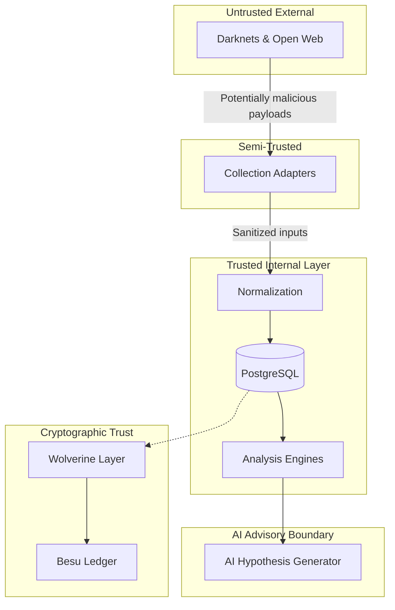

# THREAT-MODEL

## Overview

The **Wolverine Intelligence System** operates in a hostile environment dealing with active threat actors. This Threat Model defines trust boundaries, adversary scenarios, mitigations, and systemic constraints regarding evidence handling and AI generation.

## 1. System Trust Boundaries

- **External networks (untrusted)**: Tor, I2P, Clearnet, ZeroNet. We assume data retrieved is potentially malicious, manipulated, or trapped.
- **Collection adapters (semi-trusted)**: Must verify all input headers and strip malicious payloads.
- **Normalization layer (trusted transformation)**: Operates in a sandboxed environment; expected to flawlessly sanitize input.
- **PostgreSQL (trusted storage)**: Secured via standard RBAC; trust in its integrity is absolute within the boundary.
- **Analysis engines (trusted computation)**: Algorithms are deterministic and transparent.
- **AI layer (untrusted output, advisory only)**: The LLM/AI output is completely untrusted for factual assertion. It resides in an advisory bubble.
- **Wolverine (cryptographic trust anchor)**: Generates deterministic, verifiable proofs.
- **Besu (decentralized trust finality)**: Immutable ledger for final proof anchoring.
- **API (authenticated access)**: JWT-based access boundary.
- **Frontend (authenticated UI)**: User-facing boundary.

## 2. Adversary Models & Mitigations

### Adversary A: Marketplace Manipulation
**Model**: An actor attempts to pollute the intelligence database by creating fake marketplace listings linking innocent identities to malicious activity.
**Mitigation**: The system relies on the `EVIDENCE TAXONOMY`. The false listing is logged strictly as `OBSERVED`. The Attribution Engine requires multi-source verification (e.g., `STATISTICAL_MATCH` from stylometry) before elevating the observation to an actionable threat profile.

### Adversary B: Internal Sabotage
**Model**: An internal user or compromised process attempts to modify historical observations to hide an actor's trace.
**Mitigation**: **Evidence Integrity Model**. Every `OBSERVED` fact is hashed and submitted to the Wolverine Evidence Layer, which anchors the Merkle root in Besu (`CRYPTOGRAPHIC_PROOF`). Any modification to PostgreSQL breaks the hash chain, triggering immediate integrity alarms.

### Adversary C: AI Hallucination
**Model**: The MiniCPM5 model hallucinates a connection between two actors, and analysts accept it as fact.
**Mitigation**: **AI Trust Boundary**. AI is NEVER the hidden source of truth. All AI outputs are exclusively tagged as `AI_HYPOTHESIS`. The UI requires a human analyst to manually evaluate the provided context and promote the relationship, explicitly citing the original `OBSERVED` data.

### Adversary D: Scanner False Positives
**Model**: The Infrastructure Scanner interacts with a sinkhole or honeypot, polluting the database with false infrastructure indicators.
**Mitigation**: Scanners run in isolated network zones. Results are tagged with a lower confidence threshold and isolated from primary attribution scoring until corroborated by secondary intelligence (e.g., DNS history).

### Adversary E: Synthetic Data Contamination
**Model**: Simulated data generated for testing accidentally leaks into production analytics, skewing real intelligence.
**Mitigation**: All synthetic records use a dedicated UUID namespace and contain a mandatory `is_synthetic=true` flag. The production REST API filters `is_synthetic=true` globally unless explicitly requested in a developer context.

## 3. Evidence Integrity Model

The integrity of intelligence is mathematically guaranteed. Let $D_t$ be a document observed at time $t$. The system computes the hash $h_t = H(D_t)$ using SHA-256. 

Periodically, hashes are aggregated into a Merkle tree, yielding root $R_k$.
$$R_k = \text{MerkleRoot}(h_{t_1}, h_{t_2}, ..., h_{t_n})$$

$R_k$ is submitted to the Besu Trust Anchor. Retroactive modification of $D_t$ to $D'_t$ would result in $H(D'_t) \neq h_t$, breaking the validation chain.

> [!IMPORTANT]
> If a data integrity check fails, the Incident Response protocol dictates automatic isolation of the affected records, an alert to administrators, and a complete lockdown of export functions for the affected dataset.

## 4. Ethical/Legal Constraints

Wolverine must operate within strict legal and ethical bounds:
- **No active exploitation**: Scanners are passive or non-intrusive. No payloads are delivered.
- **No unauthorized scanning**: Target scope must be whitelisted.
- **No PII without authorization**: Aggregation of PII is restricted and flagged for minimization.
- **Dataset license compliance**: Third-party datasets must retain their attribution and license metadata.
- **Rate limiting and responsible collection**: Adapters must respect `robots.txt` and sensible concurrency limits.

## 5. Operational Security (OPSEC)

- **Collector Isolation**: Collection nodes operate in volatile environments, ephemeral VMs, routed through egress VPNs to mask true origin.
- **Network Separation**: The PostgreSQL database and Besu node sit on an internal VPC inaccessible from the internet.
- **Credential Management**: No secrets in source code. All adapter credentials are injected via a secure secrets manager at runtime.
