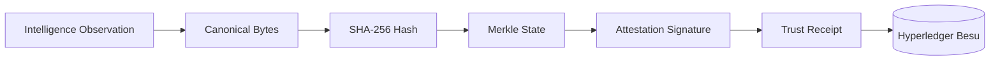

# Wolverine Intelligence: Cryptographic Evidence Layer

## 1. Purpose

The Wolverine layer provides cryptographic proof of intelligence integrity.
*   It proves that observations existed at a specific time and have not been modified.
*   It is physically and logically SEPARATE from intelligence storage (PostgreSQL).
*   It does NOT determine intelligence meaning, validity, or attribution; it only guarantees structural integrity.
*   All verified outputs belong to the `CRYPTOGRAPHIC_PROOF` evidence class.

## 2. Flow



## 3. Canonicalization

> [!CRITICAL]
> Hashing is extremely brittle. Precise canonicalization is required to ensure consistent hashing across different language environments and database representations.

Before an observation can be hashed, it must be transformed into a canonical byte representation.

*   **Target:** The canonical representation of an observation.
*   **Domain Separation:** Prefix the hash input with the domain tag: `"WOLVERINE-OBS-V1:"`.
*   **Hash Function:** SHA-256.

### Canonicalization Rules:
1.  **Key Sorting:** Sort all JSON keys alphabetically (recursively for nested objects).
2.  **Whitespace:** Remove all unnecessary whitespace (no spaces, tabs, or newlines).
3.  **Timestamps:** Use exact UTC timestamps formatted as ISO 8601 strings (e.g., `2023-10-25T14:30:00Z`).
4.  **Encoding:** Use lowercase hex encoding for all nested hashes.
5.  **Inclusions:** Include `observationId`, `network`, `portal`, `observationType`, `observedAt`, `collectedAt`, and `canonicalPayloadHash`.
6.  **Exclusions:** Exclude all mutable or meta-fields (e.g., `confidence`, `updatedAt`, `localTags`).

## 4. Merkle Construction

Observations are grouped and anchored using a binary Merkle tree.

*   **Tree Type:** Binary Merkle Tree.
*   **Leaf Node:** $H(\text{domain\_tag} || \text{canonical\_bytes})$.
*   **Internal Node:** $H(\text{left\_child} || \text{right\_child})$.
*   **Odd Leaves:** If a level has an odd number of nodes, the last node is duplicated and hashed with itself: $H(\text{last\_node} || \text{last\_node})$.
*   **Batch Size:** Configurable, typically 1000 observations per tree.

## 5. Attestation

The Merkle root computed for a batch of observations is signed by the Wolverine service key.

*   **Signature Algorithm:** ECDSA over secp256k1 (compatible with Ethereum/Besu).
*   **Service Key:** A dedicated, highly protected private key owned by the Wolverine integrity node.

### Attestation Record Schema

| Field Name | Type | Required | Description | Constraints |
| :--- | :--- | :---: | :--- | :--- |
| `merkleRoot` | bytes32 | Yes | The root hash of the Merkle tree. | Hex string |
| `observationCount` | uint | Yes | Number of observations in the tree. | |
| `firstObservationId` | UUID | Yes | ID of the first observation in the batch. | |
| `lastObservationId` | UUID | Yes | ID of the last observation in the batch. | |
| `timestamp` | uint | Yes | Unix epoch timestamp of attestation. | |
| `signature` | bytes | Yes | ECDSA signature of the `merkleRoot`. | Hex string |

## 6. Trust Receipt

After the attestation is anchored to the Besu network, a trust receipt is generated. This receipt is the primary artifact used for future verification.

### Trust Receipt Schema

| Field Name | Type | Required | Description |
| :--- | :--- | :---: | :--- |
| `receiptId` | UUID | Yes | Unique identifier for the receipt. |
| `merkleRoot` | bytes32 | Yes | The anchored Merkle root. |
| `besuTransactionHash`| bytes32 | Yes | Hash of the transaction that stored the root. |
| `besuBlockNumber` | uint | Yes | Block number where the transaction was included. |
| `besuBlockTimestamp` | uint | Yes | Timestamp of the Besu block. |
| `attestationSignature`| bytes | Yes | ECDSA signature from the attestation. |
| `observationIds` | UUID[] | Yes | Ordered array of observation IDs in the batch. |
| `createdAt` | timestamp| Yes | Time the receipt was generated. |

## 7. Besu Integration

Wolverine utilizes a Hyperledger Besu private/permissioned network to establish an immutable, decentralized ledger of state.

*   **Network Setup:** Private network utilizing IBFT 2.0 or QBFT consensus.
*   **Smart Contract:** A simple `WolverineAnchor` contract.
*   **On-Chain Storage:** The contract stores: `merkleRoot`, `timestamp`, `observationCount`.

### Smart Contract Interface

```solidity
interface IWolverineAnchor {
    event RootAnchored(bytes32 indexed merkleRoot, uint256 observationCount, uint256 timestamp);
    
    function anchorRoot(bytes32 _merkleRoot, uint256 _observationCount) external;
    function verifyRoot(bytes32 _merkleRoot) external view returns (bool exists, uint256 timestamp, uint256 observationCount);
}
```

## 8. Verification

To verify that an observation (`O`) was attested and has not been tampered with:

1.  **Retrieve:** Fetch observation `O` and its corresponding Trust Receipt.
2.  **Canonicalize:** Produce the canonical bytes of `O`.
3.  **Hash:** Recompute the leaf hash: $h = H(\text{domain\_tag} || \text{canonical}(O))$.
4.  **Fetch Proof:** Retrieve the Merkle proof (sibling hashes) from the Wolverine service.
5.  **Recompute Root:** Apply the proof to $h$ to calculate the expected root $R_{calc}$.
6.  **Verify Match:** Check that $R_{calc}$ equals the `merkleRoot` in the Trust Receipt.
7.  **Verify Signature:** Verify `attestationSignature` against $R_{calc}$ using the Wolverine public key.
8.  **Verify On-Chain:** Query the Besu contract to ensure $R_{calc}$ exists and block details match the receipt.

## 9. Versioning

> [!NOTE]
> Hash outputs change completely if the inputs change by a single bit. Versioning is essential to maintain backwards compatibility when canonicalization rules evolve.

*   **`wolverineVersion`**: Stamped on every Trust Receipt (e.g., `1.0.0`).
*   **Canonicalization Version**: Embedded in the domain tag (e.g., `WOLVERINE-OBS-V1:`).
*   **Hash Algorithm Version**: Implied by the version, but documented if migrated away from SHA-256.

## 10. Operability

### HOW TO attest a batch of observations
1. Run `wolverine-cli anchor --batch-size 1000`.
2. The service queries un-anchored observations, constructs the tree, signs the root, submits the transaction to Besu, and saves the Trust Receipt.

### HOW TO verify a single observation
1. Find the Observation ID.
2. Run `wolverine-cli verify --obs-id <UUID>`.
3. The CLI will execute the 8-step verification process and output `VALID` or `TAMPERED`.

### HOW TO inspect the Merkle tree
1. Run `wolverine-cli inspect-tree --receipt-id <UUID>`.
2. Returns the full structure of the tree, including all leaf and internal hashes.

### HOW TO query Besu for a root
1. Run `wolverine-cli query-chain --root <0x...hex...>`.
2. Retrieves the anchoring timestamp and transaction details directly from the RPC node.

### HOW TO detect if an observation has been tampered with
See detailed mathematics and procedures in [TAMPER-VERIFICATION.md](TAMPER-VERIFICATION.md).
